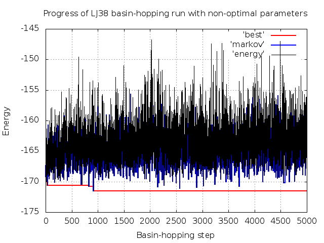

# Example 1 - Introducing GMIN

**GMIN** aims to efficiently locate the global minimum of a system by employing the basin-hopping global optimisation methodology. 
Here we use it to find the two lowest energy minima for a cluster of 38 Lennard-Jones particles, known as LJ38.

## Requirements
In order to successfully follow this example, the following needs to be in your *PATH*:
- a **GMIN** binary

## Directory contents
This directory, and the backup you can find in the *./input* subdirectory, contain all the files you need to run **GMIN** for LJ38. The *./expected_output*
subdirectory contains output from a succesful **GMIN** run to give you an idea of what you will be producing, although your output may differ slightly.

### GMIN input files

- *data* -		Some input files are optional, but every **GMIN** job requires a *data* file containing the keywords used to specify 
			how the run should proceed 
		
- *data_annotated* -	The keywords we are using in this example are detailed in *data_annotated*. While this file is not required to run **GMIN**, it is
			provided for reference. For information on the full set of keywords available, check the [GMIN website](http://www-wales.ch.cam.ac.uk/GMIN)

- *coords* - 		The (x,y,z) starting coordinates for the LJ atoms in our system, one line per atom

### Utility files

- *plot_progress.plt* -	A **gnuplot** input file that we will use to check how the various energy measures changed during the basin-hopping run

- *view_best.tcl* -	TCL script that can be used as input for **VMD** to visualise the lowest energy minimum found

- *LJcolour.tcl* - 	TCL script used by *view_best.tcl* to colour the LJ atoms according to their pair energies, revealing any symmetry

## Step-by-step

Before you start producing output, take a minute to look through *data_annotated* and make sure you understand roughly the purpose of each keyword. You will find
some keywords are commented out, starting with ' !'. These are optional values to be experimented with that we will return to later. 

### Running GMIN

Assuming you have a **GMIN** binary somewhere in your *PATH*, starting the basin-hopping run is as simple as executing it in the directory containing the input files:
```
GMIN
```
As LJ38 is a relatively small system, this won't take long to finish - around 30 seconds - and will produce a few output files that we will look at in more detail. 

First is *output*, containing a lot of information on how the job progressed. The basin-hopping procedure in **GMIN** can be broken down into three phases:

1. Initial quench (Qu) and first basin-hopping steps
```
Calculating initial energy
Qu          0 E=    -167.3731638     steps=  238 RMS= 0.44987E-02 Markov E=    -167.3731638     t=        0.0
Starting MC run of       5000 steps
Temperature will be multiplied by      1.00000000 at every step
Qu          1 E=    -168.6121576     steps=  107 RMS= 0.39064E-02 Markov E=    -167.3731638     t=        0.0
Qu          2 E=    -167.5223376     steps=  109 RMS= 0.47082E-02 Markov E=    -168.6121576     t=        0.0
```

The input coordinates (here in the file *coords*) are read in and the system is ‘quenched’ to a local minimum, giving you ‘Qu 0’ which forms the first structure 
in a Markov chain of states. **GMIN** then begins to take basin-hopping steps. A new geometry is generated according to the keywords we are using and is quenched. 
The outcome of a Metropolis test using the energy of the current Markov minimum and `TEMPERATURE` specified in *data* then determines whether we accept the new 
minimum into the Markov chain or not. If it was accepted, this minimum will be used as a starting point from which to generate the next new geometry, otherwise we 
base it on the previous step.
 
2. `STEP` size adjustment to satisfy target acceptance ratio
```
Qu         50 E=    -169.1284349     steps=  117 RMS= 0.23688E-02 Markov E=    -168.8944059     t=        0.1
Acceptance ratio for previous     50 steps=  0.6200  FAC=  1.0500
Steps are now:  STEP=    0.4200  ASTEP=    0.5355 Temperature is now:    1.0000
Qu         51 E=    -166.4647262     steps=  192 RMS= 0.43178E-02 Markov E=    -169.1284349     t=        0.1
```

Every 50 quenches, we compare the acceptance ratio for the Metropolis test to that we are hoping to attain (0.5 by default) and scale the size of the change we 
are making - here random Cartesian perturbations, applied to all particles, of maximum size specified by `STEP` - to generate new geometries to move toward the target ratio.

3. Final quenches and file output
```
Final Quench      1 energy=    -173.9284262     steps=    5 RMS force=  0.6150277E-03 time=       11.44
Final Quench      2 energy=    -173.2523776     steps=    7 RMS force=  0.9629919E-03 time=       11.44
```

Finally, after we have done the number of `STEPS` specified in *data*, or have found the `TARGET` - the `SAVE` lowest energy minima found are tightly converged 
and written to the *lowest* file:

```
          38
Energy of minimum      1=    -173.9284262     first found at step      108 after                14890 function calls
SI         0.6299851998        0.3044874184       -1.6035162520
SI         1.1252384555       -0.8376752902        1.0454755576
SI        -0.0258273467       -1.6955955872        0.4303470738
SI         1.1783957802       -0.9591345465       -0.8673414572
SI        -1.6048179648       -0.6967336611       -0.0003749866
SI        -0.0987361306        1.1034007222       -1.3541286680
```

### Visualising the progress of the basin-hopping run using gnuplot

To give us an idea of how **GMIN** is performing with the parameters we have specified in *data*, we have included the `TRACKDATA` keyword. The *best*, *markov* 
and *energy* files it produces can be visualised with gnuplot:
```
gnuplot -persist plot_progress.plt
```

The energy of each quenched minimum is shown in black. Blue shows the energy of the structure in the Markov chain (used to generate new geometries) and red 
shows the energy of the lowest energy minimum. For the default parameters included in this example, you can see that we quickly reduce the energy - locating the
global minimum within the first few hundred `STEPS`. The Markov energy continues to fluctuate, showing that we are also successfully exploring higher energy minima. 

### Visualising the lowest energy minimum with VMD

**GMIN** produces PDB and **AMBER** restart files for biological systems, but for a Lennard-Jones system we can visualise the lowest energy structure with VMD, 
colouring the atoms by their pair energies using some custom TCL scripting:

```
vmd -e view_best.tcl
```

In this colouring scheme, the symmetry of the global minimum is immediately apparent. 


## Extension: effect of varying GMIN parameters

As a learning exercise, it is interesting to investigate the effect of varying the maximum `STEP` size and `TEMPERATURE` in the **GMIN** *data* file on the
efficiency of the basin-hopping run. Some alternative values for each have been included in *data* but left commented out. Try a few different combinations, 
examining the difference in the **gnuplot** plot as before.

You can simply re-run **GMIN** as above once you have made a change as the output files will be overwritten. 

By changing these parameters, it is possible to use **GMIN** for more than just finding the global minimum. For example, with a high `TEMPERATURE` and `SAVE` 
we can harvest high energy minima that can then be used to seed molecular dynamics runs, or serve as starting points for calculating the mean first encounter time
(MFET) when random coordinates are not suitable. 


