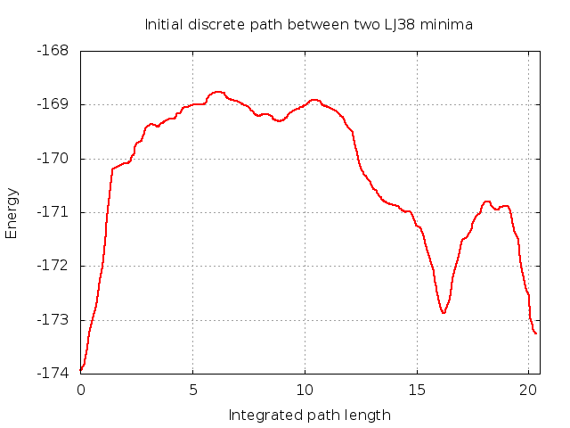

# Example 3 - Connecting minima with OPTIM

Among many other things, **OPTIM** can construct discrete paths, sequences of minima and transition states between two specified minima termed ‘endpoints’. Here we 
take the two lowest energy minima were identified using **GMIN** in Example 1 and connect them. This can give us information about the barriers between them and
the rate of interconversion. 

## Requirements
In order to successfully follow this example, the following need to be in your *PATH*:

- an **OPTIM** binary

## Directory contents
Both this directory and the backup in *./input* contain all the files you need to run **OPTIM** to connect two LJ38 minima. The *./expected_output* subdirectory 
contains output from a succesful **OPTIM** run to give you an idea of what you will be producing. Note that your output may differ!

### OPTIM input files

- *odata* -		Some input files are optional, but every **OPTIM** job requires an *odata* file containing the keywords used to specify 
			what we would like the run to achieve. Unlike **GMIN**'s *data* file, **OPTIM**'s *odata* also contains the (x,y,z) coordinates for the 
			starting 'endpoint' after the `POINTS` keyword. In this case it is the coordinates of the global minimum. 
		
- *odata_annotated* -	The keywords we are using in this example are detailed in *odata_annotated*. While this file is not required to run **OPTIM**, it is
			provided for reference. For information on the full set of keywords available, check the [OPTIM website](http://www-wales.ch.cam.ac.uk/OPTIM)

- *finish* -		The (x,y,z) coordinates for the second 'endpoint' - in this case the second lowest minimum for LJ38 		 

### Utility files

- *plot_pathway.plt* - 	**gnuplot** input file to plot the energy of states along the pathway as a function of integrated path length

- *view_pathway.tcl* - 	TCL script used by **VMD** to load the pathway found by **OPTIM** and allows you to explore the changes that occur along it

- *LJcolours.tcl* -	TCL script used by *view_pathway.tcl* to colour atoms along the pathway by their pair energies 	

## Step-by-step

Before you start producing output, take a minute to look through *odata_annotated* and make sure you understand roughly the purpose of each keyword.  

### Generating an initial discrete path using OPTIM

Assuming you have the binary somewhere in your *PATH*, running **OPTIM** and following the output is as simple as this:

```
OPTIM > optim.out & ; tail -f optim.out
```

The **OPTIM** output file we have created, *optim.out*, can be broken down into sections as follows:

1. Check endpoints and reoptimise if needed
It is possible that the endpoint structures you supply are not converged to a tight enough RMS force to satisfy the `BFGSCONV` value specified in *odata*. In this
case, **OPTIM** first tightly minimises them:
```
 OPTIM> Initial energy=    -173.9284262     RMS force=    0.6150270245E-03
 OPTIM> Final energy  =    -173.2523776     RMS force=    0.9629889347E-03
OPTIM> Bad endpoints supplied - RMS force too big!
OPTIM> Acceptable RMS force would be less or equal to     0.1000000000E-05
 mylbfgs> Resetting LBFGS minimiser
 mylbfgs> Energy and RMS force=    -173.9284262        0.6150270245E-03 after      0 steps
 mylbfgs> Energy and RMS force=    -173.9284263        0.5144541252E-03 after      1 steps, step:  0.43121E-05
```
Once both have been optimised, the final energies of the endpoints are printed. This will be useful when we want to identify them in Example 4.
```
 geopt>                          **** CONVERGED ***

 OPTIM> Initial energy=    -173.9284266     RMS force=    0.7104901138E-06
 OPTIM> Final energy  =    -173.2523784     RMS force=    0.7113993280E-06
```

2. Perform connection cycles to find a sequence of minima and transition states that form a connected pathway
**OPTIM** forms a connected pathway through a series of 'CONNECT' cycles as defined by the `NEWCONNECT` keyword in *odata*. Each connection cycle can be further
broken down as follows:
  1. Use a Dijkstra analysis to identify gaps in the pathway and select minima to connect
```
>>>>>>>>>>>>>>>>>>>>> CONNECT CYCLE 1 >>>>>>>>>>>>>>>>>>>>> 2 minima and 0 ts are known >>>>>>>>>>>>>>>>>>>>
 decide> Shortest path in Dijkstra has      1 steps with      1 missing connections, weight=     3.1410
 decide> The unconnected minima in the chain and their distances are:
     2        3.14     1
``` 
  2. Identify intervening transition states by finding initial candidates using the Doubly-Nudged Elastic Band (DNEB) approach from which true transition 
states are refined using a hybrid BFGS/eigenvector following approach and Rayleigh-Ritz minimisation. 
```
 tryconnect> First DNEB calculation will use parameters from the NEWNEB line in odata

 tryconnect> 500-iteration DNEB run for minima 1_S and 2_F using 50 images  (DNEB attempt #1)  ...
 lbfgs> Final DNEB force constant      6.446089162
 Time to go through NEB:   0.48399999999999999
 Double-ended search iterations= 299 RMS= 0.0228 Dev= 7.85% S= 7.75 time= 0.48
 Following    5 images are candidates for TS:   12   22   29   33   44
 Converged to TS (number of iterations):          5
 Converged to TS (number of iterations):         11
 Converged to TS (number of iterations):          8
 Converged to TS (number of iterations):          5
 Converged to TS (number of iterations):          4
 DNEB run yielded 5 true transition state(s) time=   0.08
```
  3. Find the minima connected to each transition state by stepping off along the steepest descent paths
```
>>>>>  Path run for ts 1 ...
 Plus  side of path:                      74 steps. Energy=    -169.4031028       time=       0.01
 Minus side of path:                     103 steps. Energy=    -173.9284266       time=       0.01

         E+        Ets - E+           Ets       Ets - E-           E-          S       D      gamma   ~N
     -169.4031028 0.41157E-01     -169.3619460  4.5665         -173.9284266   3.456   1.263   4.326   8.785
        *NEW* (Placed in 3)                                     Known (#1)
 Unconnected minimum 3 found its way to S set.
```
All the minima and transition states found are considered at the start of the next cycle when running the Dijkstra analysis and this continues
until either we have exceeded the number of allowed connection cycles, run out of pairs of minima to connect or identified a connected pathway:
```
Connected path found
  ts        E+         Ets - E+          Ets       Ets - E-          E-          S       D      gamma   ~N
   1     -173.9284266  4.5665        -169.3619460 0.41157E-01    -169.4031028   3.456   1.263   4.326   8.785
  11     -169.4031028 0.13757        -169.2655327 0.13878E-02    -169.2669205   0.649   0.485   3.826   9.933
   2     -169.2669205 0.50781        -168.7591078 0.44615        -169.2052539   3.860   1.527   2.185  17.389
  13     -169.2052539 0.29449E-01    -169.1758051 0.12866        -169.3044657   0.915   0.644   4.921   7.721
   9     -169.3044657 0.39654        -168.9079300  2.0846        -170.9924926   5.617   1.924   2.036  18.669
  12     -170.9924926 0.13425E-01    -170.9790671  1.8987        -172.8777364   1.725   0.990   6.707   5.666
   7     -172.8777364  2.0846        -170.7931234 0.16377        -170.9568946   2.374   1.043  12.352   3.076
   5     -170.9568946 0.79402E-01    -170.8774927  2.3749        -173.2523784   1.726   1.090   7.654   4.965
```
3. Output the connected pathway and associated files
Once **OPTIM** has identified a connected pathway, it produces a set of output files including:
  - *path.info* containing the coordinates and vibrational frequencies of all the minima and transition states found (not just those along the 
final pathway) in min-ts-min triples. We will be using this file in Example 4
  - *path.xyz* containing the coordinates of just the minima and transition states along the pathway 
  - *EofS* containing the energy as a function of integrated path length

### Visualising the pathway using gnuplot

The initial pathway found by **OPTIM** can be relatively non-optimal, sometimes containing unphysically high barriers or structures. A sensible first sanity
check for any pathway is to look at how the energy varies along it. In this case, we can plot the energy as a function of the integrated path length (contained
in the *EofS* file) using **gnuplot**

```
gnuplot -persist plot_pathway.plt
```

It should look something like this:

 
### Examining the structures along the pathway using VMD

We often want to investigate the mechanism involved in the pathway between endpoints, something we can do visually in this case using **VMD** to load path.xyz:
```
vmd -e view_pathway.tcl
```

When you press play at the bottom right of the 'VMD Main' window, you will start to see the conformation of the cluster evolve along the pathway. The pathway 
appears smooth as we are using the `PATH` keyword in *odata* to include intermediate structures between each station point in *path.xyz*. For this reason, 
you shouldn't use the coordinates in this file for anything else.

## Extension: connecting other minima

To connect other pairs of minima, you only need to substitute the coordinates in *odata* under `POINTS` and/or in the *finish* file. 

Run **GMIN** as in Example 1 with a high `TEMPERATURE` and `SAVE` to produce a range of high energy minima and connect some of these to the global minimum by
replacing the coordinates in finish by those in the **GMIN** *lowest* file. 

Don't forget to remove the atom names (SI) when you do this! *finish* should contain just the (x,y,z) coordinates for each atom, one atom per line.
