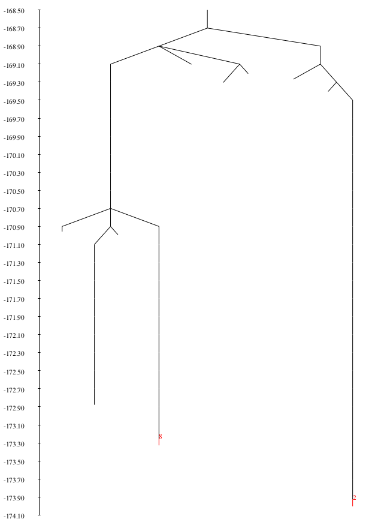

# Example 4 - Creating PATHSAMPLE database 

Once we have found an intial discrete pathway between minima (endpoints) of interest using **OPTIM**, we can create a **PATHSAMPLE** stationary point database
and grow it using built-in methods designed to create a kinetically relevent sample for further analysis.   

In this example, we will take the *path.info* file from [Example 3](../03_Connecting_minima_with_OPTIM) (here renamed as *path.info.initial*) and create a 
**PATHSAMPLE** database. We will then check that the initial pathway is still present and create a disconnectivity graph to view the landscape it explores 
using **disconnectionDPS**.

## Requirements
In order to successfully follow this example, the following need to be in your *PATH*:

- a **PATHSAMPLE** binary
- a **disconnectionDPS** binary

## Directory contents
Both this directory and the backup in *./input* contain all the files you need to run **PATHSAMPLE** to create a database. The *./expected_output* subdirectory 
contains output after all of the below steps have been followed. Your intermediate results may differ as a result.

As **PATHSAMPLE** acts as a driver for **OPTIM** (i.e. it starts **OPTIM** jobs), there are also **OPTIM** input files present. In this example we will not actually
be using them as we are simply setting up the database, but they are included as in a normal use case, they would be present.

### PATHSAMPLE input files

- *pathdata* -			Every **PATHSAMPLE** job requires a *pathdata* file containing the keywords used to specify what we would like the run to achieve.
				This example will require us to run it twice with different keywords, hence there are two sections at the bottom of
				*pathdata*, one initially commented out (starting with '! ')

- *pathdata_annotated* -	The **PATHSAMPLE** keywords we are using in this example are detailed in *pathdata_annotated*. This file is not required, it is
				provided for reference only. For information on the full set of **PATHSAMPLE** keywords available, check the
				[PATHSAMPLE website](http://www-wales.ch.cam.ac.uk/PATHSAMPLE)

- *path.info.initial* -		The **OPTIM** output file from [Example 3](../03_Connecting_minima_with_OPTIM) that contains the energy, coordinates and Hessian 
				eigenvalues of the minima and transition states found when making the initial connected pathway. We will be reading this file in to 
				create the **PATHSAMPLE** database

### OPTIM input files

- *odata.connect* -		Contains the **OPTIM** keywords used for jobs started by **PATHSAMPLE**. Although we will not be using it in this example, it is
				included for completeness. It should be noted that the major difference between this file and an *odata* file used in a standalone
				**OPTIM** job is the lack of starting coordinates following the ``POINTS`` keyword. This is because *odata.connect* acts as the
				template from which **PATHSAMPLE** can build *odata.JOBID* files for the runs it starts, adding the coordinates as appropriate

		
- *odata.connect_annotated* -	The **OPTIM** keywords present in *odata.connect* are detailed in *odata.connect_annotated*. This is only present for reference and
				is not used in the current example as explained above. For information on the full set of keywords available, check the 
				[OPTIM website](http://www-wales.ch.cam.ac.uk/OPTIM)

### disconnectionDPS input files

- *dinfo* -			Contains the keywords that control the appearence of the disconnectivty graph produced when **disconnectionDPS** is run in the
				current directory

- *dinfo_annotated* -		The **disconnectionDPS** keywords used in this example are detailed in *dinfo_annotated*. For more information and a full
				keyword listing, see the top of the *disconnectionDPS.f90* source file, available in the source tar file on the
				[Wales Group website](http://www-wales.ch.cam.ac.uk)

### Utility files

- *plot_Epath.plt* - 		**gnuplot** input file to plot the energy of the stationary points along the fastest path

- *optim.out.initial* -		The **OPTIM** output from [Example 3](../03_Connecting_minima_with_OPTIM) where *path.info.initial* was created. Used below to identify 
				the endpoints by their energy

## Step-by-step

Before you start, take a minute to look through *pathdata_annotated* and make sure you understand roughly the purpose of each keyword.  

**WARNING:** when using **PATHSAMPLE** with `PERMDIST`, it is really important that you include it in both your *odata.connect* and *pathdata* files and that the values of `ETOL`/`EDIFFTOL`, `GEOMDIFFTOL` and `RANROT` are consistent between them. This also applies to the **OPTIM** *odata* files that were used to make the initial path in [Example 3](../03_Connecting_minima_with_OPTIM).

### Creating the stationary point database

We are first going to create the initial stationary point database by reading in the *path.info,initial* file from **OPTIM** using the `STARTFROMPATH` keyword. Your
*pathdata* file should look like this, with the keywords for 'STEP 1' uncommented:

```
! PATHSAMPLE input to create an initial database from OPTIM path.info for LJ38
! For further details, see the PATHSAMPLE documentation

EXEC           /home/energy/workshop/binaries/OPTIM
CPUS           1
SYSTEM         AX
NATOMS         38
SEED           1
DIRECTION      AB
CONNECTIONS    1
TEMPERATURE    0.1

PERMDIST 
RANROT         5
ETOL           1.0D-6
GEOMDIFFTOL    0.2
ITOL           0.1D0

! STEP 1: creating the initial database from OPTIM path.info file
STARTFROMPATH  path.info.initial 1 2
CYCLES         0

! STEP 2: run a Dijkstra analysis to identify the 'fastest path' (initially commented) 
! DIJKSTRA       0
! CYCLES         0

```

Note that if we were planning on expanding the database, we would need to alter the path after `EXEC` to point to your **OPTIM** binary. As we are not, it can be set
to anything for now.

Assuming you have it somewhere in your *PATH*, we can create the database by running *PATHSAMPLE*:

```
PATHSAMPLE > pathsample_startfrompath.out
```

This will finish almost immediately as we are only adding a few stationary points. If you take a look at the bottom of the output file, you should see that the
minima and transition states from *path.info.initial* have been read into the database. You can print the output using `cat pathsample_startfrompath.out`:

```
path.info files will be read as min-sad-min triples
*************************************************************************************************
getallpaths> writing data for new ts to ts.data
getallpaths> writing data for      2 new minima to min.data
getallpaths> writing data for new ts to ts.data
getallpaths> writing data for      2 new minima to min.data
getallpaths> writing data for new ts to ts.data
getallpaths> writing data for      2 new minima to min.data
getallpaths> writing data for new ts to ts.data
getallpaths> writing data for      1 new minima to min.data
getallpaths> writing data for new ts to ts.data
getallpaths> writing data for      2 new minima to min.data
getallpaths> writing data for new ts to ts.data
getallpaths> writing data for      1 new minima to min.data
getallpaths> writing data for new ts to ts.data
getallpaths> writing data for      1 new minima to min.data
getallpaths> writing data for new ts to ts.data
getallpaths> writing data for      1 new minima to min.data
getallpaths> writing data for new ts to ts.data
getallpaths> writing data for new ts to ts.data
tsdouble> Maximum number of ts increased to       20
getallpaths> writing data for new ts to ts.data
```

The **PATHSAMPLE** database we have created here resides in four key files:

- *min.data* - 	contains the energy, logarithm of the product of positive Hessian eigenvalues, symmetry and moments of inertia for each minimum:
```
     -169.403102763540545      520.527853268869080     1       58.8399774551       60.8497059222       67.7880496912
     -173.928426590627964      538.668902793976144    48       61.0912066056       61.0912067955       61.0912072523
     -169.205253906214921      512.433786480948584     1       56.5898755232       62.7391668556       69.2875369727
```
We can refer to minima by a number, e.g. minimum 2 corresponds to line 2 of *min.data*.

- *ts.data* -	contains the energy, logarithm of the product of positive Hessian eigenvalues, symmetry, minima numbers that it connects and moments of inertia for each
		transition state:
```
     -169.361945964207905      519.008500698187277         1         1         2       59.0685138227       61.0553599196       66.9277053042
     -168.759107759549806      512.074885626003038         1         3         4       58.1406754087       60.7602915863       70.0186500961
     -168.277106889682727      513.484196133625346         1         5         6       58.0188384711       60.6742245147       71.6113255847
```
As for minima in *min.data*, transition states are identified by their line number in *ts.data*. This means that we can check how many minima and transition states
we have in our database using `wc -l min.data ts.data`:
```
  12 min.data
  11 ts.data
  23 total
```

- *points.min* -	contains the coordinates for each minimum in a binary format to keep the file size low

- *points.ts* -		contains the coordinates for each transition state in the same binary format

**TIP:** when using **PATHSAMPLE** it is a good idea to occasionally back up your database in case something goes wrong. It is these four files that you need to copy
to do so!

### Locating the endpoints in min.data

Two other files are also created with the database, *min.A* and *min.B*. These files define which minima **PATHSAMPLE** should consider to be in the product and
reactant states when doing kinetic analysis and selecting minima to connect when growing the database. They can contain a single minimum, or a group according to some
experimental observable or order parameter that defines the states of interest.

The format is simple, the first line contains the number of minima in state A or B and each subsequent line contains the number of each minimum in that group, the
corresponding *min.data* line number. In *min.A*, we currently have: 
```
         1
         1
```

This is saying that group A contains a single minimum, minimum 1.

The initial contents of these files are defined by the arguments to the `STARTFROMPATH` keyword in *pathdata* and do not correspond to the endpoint states for our
**OPTIM** pathway. Let's fix that!

To do so, we need to find the line in *min.data* that corresponds to our end point structures. This is usually done by matching their energies by looking at the
**OPTIM** output for the creating of *path.info.initial* which has been provided for convenience as *optim.out.initial*. Looking in this file we see that the 
energy of the endpoints appears twice. This is because they were reoptimised before being connected:
```
 OPTIM> Initial energy=    -173.9284262     RMS force=    0.6150270245E-03
 OPTIM> Final energy  =    -173.2523776     RMS force=    0.9629889347E-03
OPTIM> Bad endpoints supplied - RMS force too big!
OPTIM> Acceptable RMS force would be less or equal to     0.1000000000E-05
```

As a result, we ignore this first set of energies and look for the output once the optimisation has finished:
```
 geopt>                          **** CONVERGED ****

 OPTIM> Initial energy=    -173.9284266     RMS force=    0.7104901138E-06
 OPTIM> Final energy  =    -173.2523784     RMS force=    0.7113993280E-06
```

These are the energies of our endpoints. Looking in min.data we can see that these match lines 2 and 8 so let's edit *min.A* and *min.B* to contain the correct 
information:

*min.A*
```
         1
         2
```

*min.B*
```
         1
         8
```

As well as defining the endpoint (product/reactant) states, we also need to define a direction between them. This is done using the `DIRECTION` keyword in
*pathdata*. We are using `DIRECTION AB` which, according to spectroscopic convention implies 'A from B' or A<-B - hence the minima in *min.B* are our reactants and
those in *min.A* are our products.   

### Checking the connected path is still present

Before we use **PATHSAMPLE** to further explore the landscape, we need to check that we have successfully imported the whole connected path. The easiest way to do 
this is to perform a Dijkstra analysis to identify the path between the endpoints which makes the largest contribution to the steady state rate constant, often 
termed the ‘fastest path’. 

To do this requires some editing of the *pathdata* file to uncomment the keywords involved in 'STEP 2' and comment out those in 'STEP 1'. The bottom of your 
*pathdata* file after these changes should look like this:
```
! STEP 1: creating the initial database from OPTIM path.info file
! STARTFROMPATH  path.info.initial 1 2
! CYCLES         0

! STEP 2: run a Dijkstra analysis to identify the 'fastest path' (initially commented) 
DIJKSTRA       0
CYCLES         0
```

We now run **PATHSAMPLE** again to perform the analysis:

```
PATHSAMPLE > pathsample_dijkstra.out
```

This should also be very fast as our database is very small. As we (hopefully!) have a connected path in our database between the A and B minima, the output will
contain a summary in the form of sequential min-ts-min triples followed by a list of the downhill barriers in order of size:
 
```
Dijkstra> Best path for min        8 and any A minimum, k^SS A<-B    0.1078101912E-17
       2       1       4       3      12       6      10       9       8
Dijkstra> Best path between any B minimum and any A minimum:
       2       1       4       3      12       6      10       9       8
Dijkstra> Largest contribution to SS rate constant A<-B for any A and B is     0.1078101912E-17 for      8 transition states:
Dijkstra> Note that path is printed backwards starting with A, ending with B
                    E+                          Ets                         E-
       2     -173.9284265906       1     -169.3619459642       1     -169.4031027635
       1     -169.4031027635       9     -169.2655326538       4     -169.2669204568
       4     -169.2669204568       2     -168.7591077595       3     -169.2052539062
       3     -169.2052539062      11     -169.1758050760      12     -169.3044656797
      12     -169.3044656797       8     -168.9079300331       6     -170.9924926291
       6     -170.9924926291      10     -170.9790671321      10     -172.8777364112
      10     -172.8777364112       6     -170.7931234338       9     -170.9568946176
       9     -170.9568946176       5     -170.8774926607       8     -173.2523784156
Dijkstra> Ordered downhill barriers,    ts        barrier
                                          5     2.374885755
                                          8     2.084562596
                                         10     1.898669279
                                          2    0.4461461467
                                          6    0.1637711838
                                         11    0.1286606037
                                          1    0.4115679933E-01
                                          9    0.1387803054E-02
```

As stated, this pathway is printed backwards, so start from the bottom right and read right to left - minimum 8 -> minimum 9 (via transition state 5) and so on.

### Visualising the fastest path

The Dijkstra analysis also produces an *Epath* file containing the energy of the minima and transition states along the fastest path. We can visualise this
using **gnuplot** to check the pathway looks sensible.

Unlike in [Example 3](../03_Connecting_minima_with_OPTIM), no smoothing is used - the plot is showing only the stationary points:

```
gnuplot -persist plot_Epath.png
```


### Creating a disconnectivity graph

In order to display the multidimensional potential energy surface of a system of any reasonable size without projecting along somewhat arbitrary order parameters, 
we use the disconnectivity graph representation. To do this, we use **disconnectionDPS** with keywords specified in its input file, *dinfo*.

Minima are divided into ‘superbasins’ at regular intervals specified by the `DELTA` keyword. Each minimum in the database is represented by a line that starts 
from the superbasin the minimum belongs to, and terminates at the potential energy of that minimum. The lines are arranged along the horizontal axis to produce 
the clearest representation, so the horizontal axis has no physical meaning. The vertical axis is potential energy.

To create and view a disconnectivity graph (often referred to as a 'tree') for your **PATHSAMPLE** database, simply run **disconnectionDPS** followed by **gv**:
```
disconnectionDPS; gv tree.ps
```

You should produce something like this:



Using the `IDMIN` keyword in the *dinfo* file, we have labelled the endpoints, minima 2 and 8 and can start to gain an understanding
of the underlying topology of the energy landscape for LJ38. When combined with keywords that colour branches by an experimentally interesting order parameter, or
committor probability - great insight can be gained from exploring the structure of these trees!

## Extension: identifying other minima of interest

A very useful keyword for **disconnectionDPS** is `IDENTIFY`. This will label ALL minima on the disconnectivity graph, making it very easy to identify what might
be an interesting structural feature, and then drill down to look at specific structures.

Add the `IDENTIFY` keyword to your *dinfo* file and re-run **disconnectionDPS**. Take a look at the resulting tree and see if you can follow the steps of the
fastest path between the endpoints across the landscape by matching the energies from your Dijkstra analysis to line numbers in min.data and hence minima on the tree.
