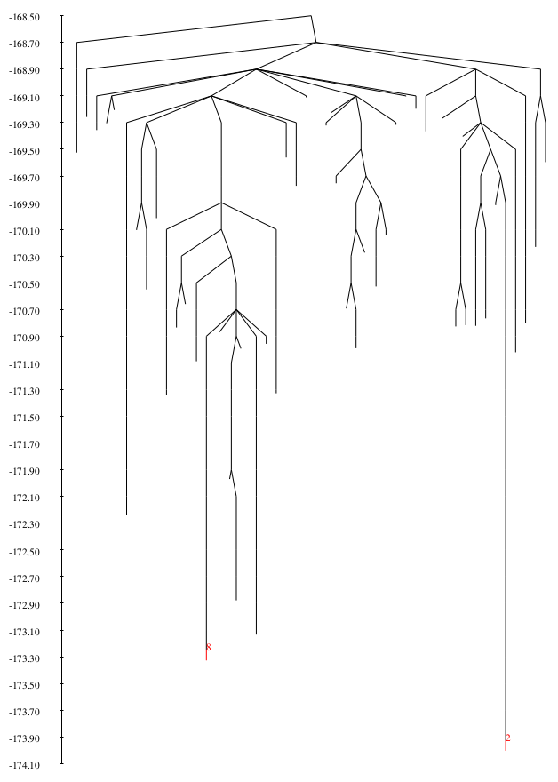

# Example 5 - Expanding PATHSAMPLE database

Although identifying a single discrete path for a system can give us some information on the kinetics and underlying energy landscape, we are likely to be 
missing many kinetically relevent states and as such, should be wary of drawing conclusions from our initial results. **PATHSAMPLE** provides a range of methods
to allow us to efficiently expand our stationary point database to achieve a more kinetically relevent sample.

All of these methods focus on ways of selecting pairs of minima in our database to connect using **OPTIM**. For example, the `SHORTCUT` method aims to
choose pairs to reconnect that will reduce the overall length of the path between endpoints, while `SHORTCUT BARRIER` aims to find alternative connections to avoid
the largest barriers between them. 

In this example, we will be using `UNTRAP`, another of these methods that aims to reconnect minima similar in energy but seperated by large barriers - often referred
to as kinetic traps. For more information all these and other methods, check the [PATHSAMPLE website](http://www-wales.ch.cam.ac.uk/PATHSAMPLE).  

## Requirements
In order to successfully follow this example, the following need to be in your *PATH*:

- a **PATHSAMPLE** binary
- an **OPTIM** binary
- a **disconnectionDPS** binary

## Directory contents
Both this directory and the backup in *./input* contain all the files you need to run **PATHSAMPLE** to expand the database created in Example 4. 
The *./expected_output* subdirectory contains output after all of the below steps have been followed. Your intermediate results may differ as a result.

As **PATHSAMPLE** acts as a driver for **OPTIM** (i.e. it starts **OPTIM** jobs), there are also **OPTIM** input files present.

### PATHSAMPLE input files

- *pathdata* -			Every **PATHSAMPLE** job requires a *pathdata* file containing the keywords used to specify what we would like the run to achieve.
				This example will require us to run it twice with different keywords, hence there are two sections at the bottom of
				*pathdata*, one initially commented out (starting with '! ')

- *pathdata_annotated* -	The **PATHSAMPLE** keywords we are using in this example are detailed in *pathdata_annotated*. This file is not required, it is
				provided for reference only. For information on the full set of **PATHSAMPLE** keywords available, check the
				[PATHSAMPLE website](http://www-wales.ch.cam.ac.uk/PATHSAMPLE)

- *min.A* -			Defines which minima should be considered part of the A group - the products or reactants depending on how we specify the `DIRECTION`
				in *pathdata*

- *min.B* -			Defines which minima should be considered part of the B group - the products or reactants depending on how we specify the `DIRECTION`
				in *pathdata*

### PATHSAMPLE database files

- *min.data* - 	Contains the energy, log product of vibrational frequencies, symmetry and moments of inertia for each minimum. A minimum is identified by its
		line number in this file

- *ts.data* -	Contains the energy, log product of vibrational frequencies, symmetry, minima numbers that it connects and moments of intertia for each
		transition state. A transition state is identified by its line number in this file

- *points.min* -	Contains the coordinates for each minimum in a binary format to keep the file size low

- *points.ts* -		Contains the coordinates for each transition state in the same binary format

### OPTIM input files

- *odata.connect* -		Contains the **OPTIM** keywords used for jobs started by **PATHSAMPLE**. 
				It should be noted that the major difference between this file and an *odata* file used in a standalone
				**OPTIM** job is the lack of starting coordinates following the ``POINTS`` keyword. This is because *odata.connect* acts as the
				template from which **PATHSAMPLE** can build *odata.JOBID* files for the runs it starts, adding the coordinates as appropriate

		
- *odata.connect_annotated* -	The **OPTIM** keywords present in *odata.connect* are detailed in *odata.connect_annotated*.
				For information on the full set of keywords available, check the [OPTIM website](http://www-wales.ch.cam.ac.uk/OPTIM)

### disconnectionDPS input files

- *dinfo* -			Contains the keywords that control the appearence of the disconnectivty graph produced when **disconnectionDPS** is run in the
				current directory

- *dinfo_annotated* -		The **disconnectionDPS** keywords used in this example are detailed in *dinfo_annotated*. For more information and a full
				keyword listing, see the top of the *disconnectionDPS.f90* source file, available in the source tar file on the
				[Wales Group website](http://www-wales.ch.cam.ac.uk)

## Step-by-step

Before you start, take a minute to look through *pathdata_annotated* and *odata.connect_annotated* and make sure you understand roughly the purpose of each keyword.  

You may also need to slightly alter your *pathdata* file to ensure that the `EXEC` keyword points to a valid **OPTIM** binary.

### Expanding the stationary point database

Starting **PATHSAMPLE** and following the output can be achieved as follows:

```
PATHSAMPLE > pathsample_untrap.out & ; tail -f pathsample_untrap.out
``` 

Like **OPTIM**, **PATHSAMPLE** runs in `CYCLES` - each cycle starting the number of **OPTIM** jobs that fill the number of CPUs/GPUs available. This example is set up
to run locally on a single core as specified by `CPUS 1` in *pathdata*. These **OPTIM** jobs are embarassingly parallel in that we can easily scale up the number 
of jobs run at once with little penalty as they do not depend on each other. 

As **OPTIM** jobs can be starting and finishing in close proximity, the **PATHSAMPLE** output can become slightly fragmented. For clarity, a cycle is broken down
into the following stages:

- Identify pairs of minima to connect and start **OPTIM** jobs for each:

```
getupair> connecting minima        7 and        9 pairs used=       5 remaining=       6 total pairs=       4
```

The order in which these pairs are selected depends on the metric being used. In this case, we select pairs according to the `UNTRAP` metric described above. As
we are only using a single core (`CPUS 1`), only one pair is connected at a time. Feel free to change this if you have more cores available.

- Analyse the minima and transition states that each **OPTIM** job returns and add anything new to the stationary point database:

```
cycle2> analysing result of search        5 on CPU        1 for process id      737
getallpaths> writing data for new ts to ts.data
getallpaths> writing data for      1 new minima to min.data
getallpaths> writing data for new ts to ts.data
```

As each **OPTIM** run finishes, **PATHSAMPLE** analyses the minima and transition states found and checks to see if they match existing structures in the database
using an energy (`ETOL`) and geometric (`GEOMDIFFTOL`) cutoff. If they are new, they are added to *min.data* and *ts.data* respectively and will be considered as
possible endpoints for reconnection in subsequent cycles. 

- Print a summary of what was found during the cycle and the current database size:

```
--------------------------------------------------------------------------------------------------------------
cycle2> end of cycle        5 new min=       1 new ts=       2 total min=      13 total ts=      13
--------------------------------------------------------------------------------------------------------------
```

**PATHSAMPLE** will continue to run until either all possible pairs have been tried or it runs out of `CYCLES`. It is quite robust to being interupted and
so can be stopped early and restarted as often as you like.

**NOTE:** if you are using **PATHSAMPLE** on a compute cluster, take a look at the `PBS`/`SLURM` and `SSH` keywords on the 
[PATHSAMPLE website](http://www-wales.ch.cam.ac.uk/PATHSAMPLE) for information on how to specify the number of **OPTIM** jobs to run in parallel.

### Creating a disconnectivity graph

Now that we have expanded our initial stationary point database, we can visualise the energy landscape using a disconnectivity graph as we did in Example 4 for the
initial **OPTIM** path to see how things have changed. 

The disconnectivity graph representation allows us to display the multidimensional potential energy surface of a system of a reasonable size without projecting 
along somewhat arbitrary order parameters. To create it, we use **disconnectionDPS** with keywords specified in its input file, *dinfo*.

Recapping from Example 4, minima are divided into ‘superbasins’ at regular intervals specified by the `DELTA` keyword. Each minimum in the database is 
represented by a line that starts from the superbasin the minimum belongs to, and terminates at the potential energy of that minimum. The lines are arranged 
along the horizontal axis to produce the clearest representation, so the horizontal axis has no physical meaning.

To create and view a disconnectivity graph (often referred to as a 'tree') for your **PATHSAMPLE** database, simply run **disconnectionDPS** followed by **gv**:
```
disconnectionDPS; gv tree.ps
```
You should produce something like this:



Using the `IDMIN` keyword in the *dinfo* file, we have labelled the endpoints, minima 2 and 8. If you have completed Example 4, you will note that the landscape
appears significantly more populated, with distinct funnels starting to appear. 

It is likely that if you started `PATHSAMPLE` again, you could continue to find minima and transition states and further flesh out the landscape, which leads on to
a really important question....

### Q: When do you stop?!

Knowing when to stop running **PATHSAMPLE** can be quite tricky to judge. For a system of any reasonable size, it is unrealistic to attempt to sample every minimum
and transition state on the energy landscape so we have to find a way to judge 'convergence'. How you go about doing this depends very much on the goal of your work.
Are you attempting to gain insight into a specific mechanism that has a known experimental rate? Maybe you would continue until you have hit that target. 

There is no 'right' answer to this question, which is why it's such a tough one. The advice we can give is to consider carefully your criteria for 'success' and 
to leverage any experimental information e.g. melting point, rate or other experimental observable measureable that can be calculated using a structural order 
parameter to construct a sensible measure for convergence.

In this example, we're going to just stop after 50 `CYCLES` but will do so in the knowledge that we have almost certainly not explored enough!

## Extension: understanding why minima are being selected for connection

When using PATHSAMPLE to expand a database and optimise a pathway, the choice of parameters for the minima selection method (e.g. `UNTRAP`) can be critical. It is 
highly recommended that before you leave **PATHSAMPLE** running for a month on 128 cores, you check that the minima it is choosing to connect make some intuitive
sense!

This is most easily done by including the `DUMMYRUN` keyword in *pathdata*. This will cause **PATHSAMPLE** to act exactly as it would in a normal run, but no **OPTIM**
jobs will be actually started. This means that you can briefly run the job and look into the output being produced to see which minima are being selected for
connection.

Identify which minima are being initially selected by `UNTRAP` in this example by looking at the top of your **PATHSAMPLE** output where the pairs are printed, just
below this section:
```
getupair> lowest minimum in product set lies at     -173.9284266
getupair> highest transition state lies at     -168.2771069
getupair> sorted list of       11 pairs
```

Generate a new disconnectivity graph using **disconnectionDPS** with these minima identified using `IDMIN` in *dinfo*. Check that you are happy that these minima
make sense to be reconnected if we are trying to eliminate kinetic traps between our specified endpoints (minima 8 and 2). 

Feel free to change the parameters of `UNTRAP` and add `DUMMYRUN` to *pathdata* and see how this affects the pairs being choosen. 
