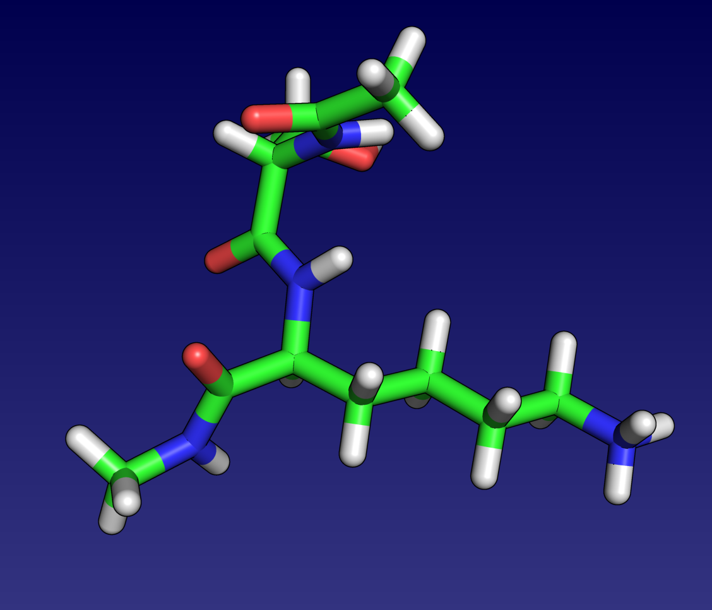
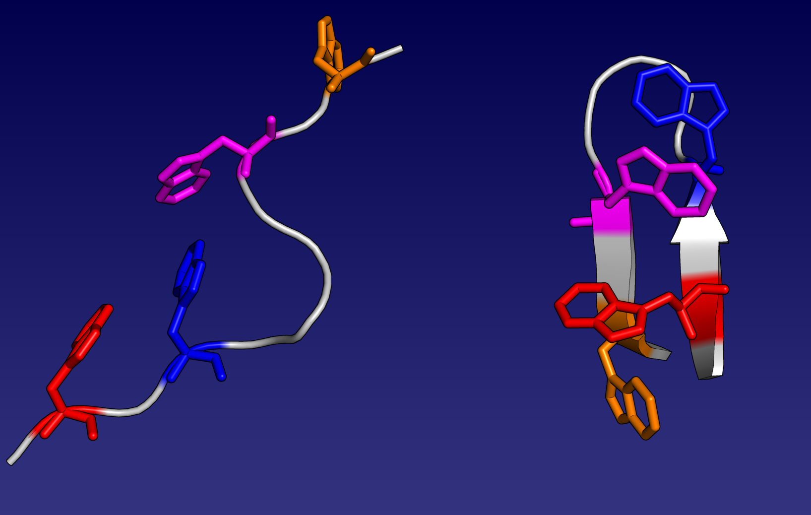

# Getting started with GMIN, OPTIM and PATHSAMPLE
These directories contain example input and output for the **GMIN**, **OPTIM** and **PATHSAMPLE** codes developed in the Wales Group at the University of Cambridge. 

## Prerequisites

In order to run through these examples, you will need to either use a build of the Wales Group VM, or have the following Ubuntu packages installed via `apt-get`:

- to compile the code
```
sudo apt-get install build-essential gfortran cmake cmake-curses-gui csh bison flex libblas-dev liblapack-dev
```

- utility programs for visualisation etc
```
sudo apt-get install vim git subversion gnuplot-x11 gv
```

Acquiring the source code for **GMIN**, **OPTIM** and **PATHSAMPLE** and compiling the code using **cmake** is discussed in detail below.

## Example systems

### [LJ38](./LJ38) - a 38 atom Lennard-Jones cluster

- Basin-hopping with **GMIN**
- Calculating the mean first encounter time (MFET)
- Connecting minima with a discrete path using **OPTIM**
- Setting up a **PATHSAMPLE** database using an **OPTIM** *path.info* file
- Expanding a **PATHSAMPLE** database in a targeted way

### [tetra-ALA](./tetra_ALA) - an alanine polypeptide (AMBER)

- Basin-hopping with **A9GMIN**
- Investigating the effect of removing C-alpha chirality checks 
- Connecting minima with a discrete path using **A9OPTIM**
- Setting up a **PATHSAMPLE** database using an **A9OPTIM** *path.info* file
- Expanding a **PATHSAMPLE** database in a targeted way

### [SER-LYS](./SER_LYS) - a capped dipeptide (AMBER)


- Basin-hopping with **GMIN**
- Free energy basin-hopping using **A9GMIN** to investigate the effect of entropy

### [trypzip](./trypzip) - a 12 residue tryptophan zipper (AMBER)


**CHALLENGE!**

- Efficiently expand a **PATHSAMPLE** database for a provided initial folding path
- Requires much trial and error!

## Compiling the Wales Group codes

### Obtaining the source code

The source code can be obtained from the Wales group website [here](http://www-wales.ch.cam.ac.uk/svn.tar.bz2) or using `wget` like so:

```
wget http://www-wales.ch.cam.ac.uk/svn.tar.bz2
```

**NOTE:** Due to licensing issues, we cannot distribute the **AMBER** or **CHARMM** interfaced versions of our source code. If you have a license for either, contact
[David Wales](mailto:dw34@cam.ac.uk) and request access to the restricted code.

Copy the tar file into a working directory and uncompress it as follows: 

```
tar xvfj svn.tar.bz2
```

Replace the file name as necessary should you have a version of the source containing the AMBER or CHARMM interface. Now, change directory until you see a set of folders including
one for **GMIN**, one for **OPTIM** and one for **PATHSAMPLE**.

### Compiling GMIN

All **cmake** builds are 'out of source' i.e. we build the binary in a directory that does not contain the source code. As a result, the first thing we need to do is create
a build directory and move into it (note the nifty shortcut!):

```
mkdir -p GMIN/build/gfortran
cd !$
```

In this example, we are going to build vanilla **GMIN** using **gfortran**. First, we run **cmake** specifying the compiler using the `FC` environment variable and the source
directory:

```
FC=gfortran cmake ../../source
```

You should see some output similar to the following:

```
energy@landscapes:~/workshop/code/GMIN/build/gfortran$ FC=gfortran cmake ../../source
-- The C compiler identification is GNU 4.8.4
-- The CXX compiler identification is GNU 4.8.4
-- Check for working C compiler: /usr/bin/cc
-- Check for working C compiler: /usr/bin/cc -- works
-- Detecting C compiler ABI info
-- Detecting C compiler ABI info - done
-- Check for working CXX compiler: /usr/bin/c++
-- Check for working CXX compiler: /usr/bin/c++ -- works
-- Detecting CXX compiler ABI info
-- Detecting CXX compiler ABI info - done
-- The Fortran compiler identification is GNU
-- Check for working Fortran compiler: /usr/bin/gfortran
-- Check for working Fortran compiler: /usr/bin/gfortran  -- works
-- Detecting Fortran compiler ABI info
-- Detecting Fortran compiler ABI info - done
-- Checking whether /usr/bin/gfortran supports Fortran 90
-- Checking whether /usr/bin/gfortran supports Fortran 90 -- yes
FC_PROGNAME = gfortran
Compiler switch = gfortran
Setting initial values for compiler flags
CMAKE_Fortran_COMPILER = /usr/bin/gfortran
/home/energy/workshop/code/CMakeModules/FindMYBLAS.cmake: creating BLAS library.
/home/energy/workshop/code/CMakeModules/FindMYLAPACK.cmake: creating LAPACK library.
-- Configuring done
-- Generating done
-- Build files have been written to: /home/energy/workshop/code/GMIN/build/gfortran
```

To see additional options for the compilation (including enabling the interfaces to **AMBER** and **CHARMM**) you can run ``ccmake .`` in your build directory.
If you make any changes here, make sure you 'configure' (`c`), 'exit' (`e`) and then 'generate' (`g`). You may need to do this twice for some builds. 
Pressing `q` will quit without making changes.

Assuming you didn't see any errors - you're now ready to compile **GMIN** as follows, replacing `X` with the number of cores (found by typing `nproc`). If in doubt, use 1:

```
make -jX
```

This may take some time depending on how many cores you have available. When it's done, you should see a **GMIN** binary in the build directory:

```
...
Scanning dependencies of target GMIN
[100%] Building Fortran object CMakeFiles/GMIN.dir/main.F.o
Linking Fortran executable GMIN
[100%] Built target GMIN
energy@landscapes:~/workshop/code/GMIN/build/gfortran$ ls
CMakeCache.txt  cmake_install.cmake  GMIN           libgminlib.a   libmbpol     libmylapack.a  modules
CMakeFiles      display_version.f90  libextralib.a  liblibmbpol.a  libmyblas.a  Makefile       porfuncs.f90
```

Finally, move the binary into your `$PATH` so that you can run it anywhere by simply typing `GMIN`.

If you have access to the **AMBER** or **CHARMM** interfaces source code or a different compiler, you may wish to build a different version of **GMIN**. A few examples for
specific builds are provided here for reference, but this list is not comprehensive:

- **A9GMIN** (GMIN with AMBER9) using the ifort compiler:
```
mkdir -p GMIN/builds/ifort_amber9
cd !$
FC=ifort cmake -DWITH_AMBER9=1 ../../source
make -jX
```

- **C35GMIN** (GMIN with CHARMM 35) using the pgf90 compiler:
```
mkdir -p GMIN/builds/pgi_charmm35
cd !$
FC=pgf90 cmake -DWITH_CHARMM35=1 ../../source
make -jX
```

- **CUDAGMIN** (GMIN leveraging GPU minimisation via the AMBER 12 interface) using the ifort compiler:
```
mkdir -p GMIN/builds/ifort_cuda
cd !$
FC=ifort cmake -DWITH_CUDA=1 ../../source
make -jX
```
**NOTE:** requires the **CUDA** toolkit to be installed at version 5.5 or higher.

### Compiling OPTIM

Like **GMIN** above, **OPTIM** is easily compiled with **cmake**. Skipping straight to the examples (replace `X` by the number of cores to use):

- **OPTIM** with the gfortran compiler
```
mkdir -p GMIN/build/gfortran
cd !$
FC=gfortran cmake ../../source
make -jX
```

- **A12OPTIM** (OPTIM with AMBER12) using the ifort compiler:
```
mkdir -p OPTIM/builds/ifort_amber12
cd !$
FC=ifort cmake -DWITH_AMBER12=1 ../../source
make -jX
```

- **C35OPTIM** (OPTIM with CHARMM 35) using the pgf90 compiler:
```
mkdir -p OPTIM/builds/pgi_charmm35
cd !$
FC=pgf90 cmake -DWITH_CHARMM35=1 ../../source
make -jX
```

- **CUDAOPTIM** (OPTIM leveraging GPU via the AMBER 12 interface) using the ifort compiler:
```
mkdir -p OPTIM/builds/ifort_cuda
cd !$
FC=ifort cmake -DWITH_CUDA=1 ../../source
make -jX
```
**NOTE:** requires the **CUDA** toolkit to be installed at version 5.5 or higher.

### Compiling PATHSAMPLE

**PATHSAMPLE** has very limited build options as it does not interface with any specific potential. To ensure binary file formats are readable, you should be using the same
compiler for both **OPTIM** and **PATHSAMAPLE**!

Again replacing `X` with the number of cores in the examples below:

- **PATHSAMPLE** using the gfortran compiler
```
mkdir -p PATHSAMPLE/builds/gfortran
cd !$
FC=gfortran cmake ../../source
make -jX
```

- **PATHSAMPLE** using the NAG compiler
```
mkdir -p PATHSAMPLE/builds/nagfor
cd !$
FC=nagfor cmake ../../source
make -jX
```

### Compiling disconnectionDPS

**disconnectionDPS** is used to createdisconnectivity graphs from **PATHSAMPLE** databases. It can be compiled in a single step from the source as follows:

```
cd DISCONNECT/source
gfortran -o disconnectionDPS disconnectionDPS.f90
```
