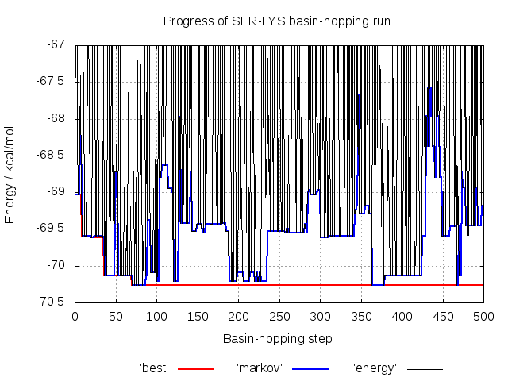

# Example 1 - Basin-hopping with GMIN

**GMIN** aims to efficiently locate the global minimum of a system by employing the basin-hopping global optimisation methodology. **A12GMIN** is simply a version of **GMIN**
that is interfaced to the **AMBER 12** potential. Here we use it to find the twenty lowest **potential** energy minima for the SER-LYS dipeptide. 

## Requirements
In order to successfully follow this example, the following needs to be in your *PATH*:
- an **A12GMIN** binary

## Directory contents
This directory, and the backup you can find in the *./input* subdirectory contains all the files you need to run **A12GMIN** for SER-LYS.
The *./expected_output* subdirectory contains output from a succesful **A12GMIN** run to give you an idea of what you will be producing, although your output may differ slightly.

### GMIN input files

- *data* -		Some input files are optional, but every **GMIN** job requires a *data* file containing the keywords used to specify 
			how the run should proceed 
		
- *data_annotated* -	The keywords we are using in this example are detailed in *data_annotated*. While this file is not required to run **GMIN**, it is
			provided for reference. For information on the full set of keywords available, check the [GMIN website](http://www-wales.ch.cam.ac.uk/GMIN)

- *coords.prmtop* -	The symmetrised (see the note below!) **AMBER** topology file for SER-LYS using parameters from the **AMBER** ff99SB force field

- *coords.inpcrd* -  	The starting coordinates for the SER-LYS atoms in our system in **AMBER** restart format

- *min.in* -		The **AMBER** force field parameters to use to calculate the energy and gradient. 

- *min.in_annotated* -	Not used during the run. Contains additional information about the **AMBER** parameters used in this exammple. See the **AMBER** manual for more information

- *atomgroups* -	Defines the rotatable groups for the `GROUPROTATION` **GMIN** keyword, used to generate new configurations during basin-hopping

- *atomgroups_annotated* - Describes how the `GROUPROTATION` groups are defined. See the [GMIN documentation](http://www-wales.ch.cam.ac.uk/GMIN) for more examples

**IMPORTANT NOTE:** the **AMBER** and **CHARMM** force fields are not symmetrised with respect to permutational isomerisation! This is particularly troublesome for methods 
like these which rely partially on the energy to discriminate between minima. Without proper symmetrisation, permutational isomers (e.g. rotated methyl groups) can have different 
energies, resulting in 'twinning' of minima. 

For **AMBER** we resolve this by symmetrising the problem improper dihedral angles in the topology file after creating it using a Python script. You can find the script in the 
source code here:

```
SCRIPTS/AMBER/symmetrise_prmtop/perm-prmtop.ff03.py
```

Despite being labelled `ff03` - this script is also works for the ff99SB force field. For more details, see the script and the paper discussing this issue
[here](http://onlinelibrary.wiley.com/doi/10.1002/jcc.21425/abstract).

In this example, we have symmetrised the topology files for you. If you are ever unsure about your input, exchange the coordinates of what should be two identical atoms and
check that the energy does not change.

### Utility files

- *plot_progress.plt* -	A **gnuplot** input file that we will use to check how the various energy measures changed during the basin-hopping run

## Step-by-step

Before you start producing output, take a minute to look through *data_annotated* and make sure you understand roughly the purpose of each keyword. 

### Running A12GMIN

Assuming you have a **A12GMIN** binary somewhere in your *PATH*, starting the basin-hopping run is as simple as executing it in the directory containing the input files:
```
A12GMIN &
```

The output can then be view as follows:

```
tail -f output
```

IF you would like to only see the 'quenches', you can filter this using `grep`:

```
tail -f output | grep Qu
```

As SER-LYS is a relatively small system, this won't take too long to finish and will produce a few output files that we will look at in more detail. 

First is *output*, containing a lot of information on how the job progressed. The basin-hopping procedure in **GMIN** can be broken down into three phases:

- Initial quench (Qu) and first basin-hopping step


```
Qu          0 E=    -69.02914619     steps=  363 RMS= 0.58988E-06 Markov E=    -69.02914619     t=        0.1
 mc> Storing cis/trans information for initial structure
Starting MC run of        500 steps
Temperature will be multiplied by      1.00000000 at every step
 GROUPROTATION> Rotating group 2_LYS_CG_C by   -26.152120575176347     
 GROUPROTATION> Rotating group 2_LYS_CA_C by   -31.948227081195842     
 GROUPROTATION> Rotating group 1_SER_C_CA by    17.377026398998911     
 GROUPROTATION> Rotating group 2_LYS_CD_C by   -12.905109644569674     
 GROUPROTATION> Rotating group 1_SER_CA_C by    24.940315671458411     
 GROUPROTATION> Rotating group 2_LYS_CB_C by   -38.338063104136182     
Qu          1 E=    -67.42837181     steps=  340 RMS= 0.88616E-06 Markov E=    -69.02914619     t=        0.3
```

The input coordinates (here in the file *coords.inpcrd*) are read in and the system is ‘quenched’ to a local minimum, giving you ‘Qu 0’ which forms the first structure 
in a Markov chain of states. **GMIN** then begins to take basin-hopping steps. A new geometry is generated according to the keywords we are using and is quenched. 
The outcome of a Metropolis test using the energy of the current Markov minimum and `TEMPERATURE` specified in *data* then determines whether we accept the new 
minimum into the Markov chain or not. If it was accepted, this minimum will be used as a starting point from which to generate the next new geometry, otherwise we 
base it on the previous step.

As we have `GROUPROTATION 1` in our *data* file, every step we rotate a random selection of groups as defined in *atomgroups* according to their selection probabilities
and maximum rotational amplitudes. 

- `STEP` size adjustment to satisfy target acceptance ratio
```
Qu         50 E=    -68.71271990     steps=  307 RMS= 0.45447E-06 Markov E=    -68.71271990     t=        6.5
Acceptance ratio for previous     50 steps=  0.5400  FAC=  1.0500
Steps are now:  STEP=    1.0500 Temperature is now:    0.8000
```

Every 50 quenches, we compare the acceptance ratio for the Metropolis test to that we are hoping to attain (0.5 by default) and scale the size of the change we 
are making - here random Cartesian perturbations, applied to all particles, of maximum size specified by `STEP` and rotations of groups of atoms by `GROUPROTATION` as defined in 
*atomgroups* - to generate new geometries to move toward the target ratio.

- Final quenches and file output
```
Final Quench      1 energy=    -70.25982585     steps=   75 RMS force=  0.9460749E-08 time=       67.99
Final Quench      2 energy=    -70.21328363     steps=   53 RMS force=  0.9521047E-08 time=       68.00
Final Quench      3 energy=    -70.13274264     steps=   31 RMS force=  0.9908671E-08 time=       68.01
Final Quench      4 energy=    -70.08905333     steps=   49 RMS force=  0.9572887E-08 time=       68.02
Final Quench      5 energy=    -69.61201365     steps=   54 RMS force=  0.9999888E-08 time=       68.04
Final Quench      6 energy=    -69.59167131     steps=   27 RMS force=  0.9103036E-08 time=       68.05
Final Quench      7 energy=    -69.59143027     steps=   56 RMS force=  0.9978840E-08 time=       68.06
Final Quench      8 energy=    -69.55252318     steps=   41 RMS force=  0.9145808E-08 time=       68.07
Final Quench      9 energy=    -69.52933536     steps=   80 RMS force=  0.9925816E-08 time=       68.10
Final Quench     10 energy=    -69.46504515     steps=   25 RMS force=  0.9734771E-08 time=       68.10
...
```

Finally, after we have done the number of `STEPS` specified in *data*, or have found the `TARGET` - the `SAVE` lowest energy minima found are tightly converged 
and written to the *lowest* file in XYZ format:

```
          45
Energy of minimum      1=    -70.25982585     first found at step       70 after                23878 function calls
HH31       -5.0523014171       -2.8369218949       -2.7384830364
CH3        -4.8686308325       -2.2820412072       -1.8189543818
HH32       -5.7028174960       -2.4306405870       -1.1336694889
HH33       -4.7755131719       -1.2217187376       -2.0517849298
C          -3.5828891328       -2.7743886246       -1.1818033253
O          -3.5863571025       -3.2538592050       -0.0488996109
N          -2.4693336924       -2.6437358908       -1.9008317216
H          -2.5475202205       -2.2801893033       -2.8419185106
CA         -1.1477144792       -3.1657387604       -1.4981717535
HA         -1.2443273603       -4.2294520956       -1.2766946443
CB         -0.1559875305       -3.0204557121       -2.6650123854
...
```

The `SAVE` lowest energy minima are also output as individual files in both PDB (*lowestX.1.pdb*) and **AMBER** restart (*minX.1.rst*) format for minimum X in ascending energy order.

### Visualising the progress of the basin-hopping run using gnuplot


To give us an idea of how **GMIN** is performing with the parameters we have specified in *data*, we have included the `TRACKDATA` keyword. The *best*, *markov* 
and *energy* files it produces can be visualised with gnuplot:
```
gnuplot -persist plot_progress.plt
```

The energy of each quenched minimum is shown in black. Blue shows the energy of the structure in the Markov chain (used to generate new geometries) and red 
shows the energy of the lowest energy minimum. 

Here you can see the energy of some quenches spikes well above the Markov energy, corresponding to unphysical structures
which are automatically rejected.

### Visualising the lowest energy minimum with VMD

**GMIN** produces PDB and **AMBER** restart files for biological systems which you can load one at a time using **VMD** as follows for the lowest energy minimum found:

- from the .pdb files
```
vmd -pdb coords.1.pdb
```

- from the .rst files
```
vmd -parm7 coords.prmtop -rst7 coords.1.rst
```

Here we load the coordinates from the .rst file into the molecular topology we load from the **AMBER** topology file *coords.prmtop*. 
We can also view all of our saved minima as a pseudo trajectory by directly loading the *lowest* file:

```
vmd -parm7 coords.prmtop -xyz lowest
```

Here frame 0 is the lowest energy minimum with the energy rising along the 'trajectory'. Because **VMD** considers this a trajectory, you can use the 'RMSD Trajectory Tool' as you
would for MD to align the minima, making it easy to compare them.

## Extension: the effect of varying the step size and temperature

As a learning exercise, it is interesting to investigate the effect of varying the maximum cartesian `STEP` size, the `GROUPROTATION` frequency and `TEMPERATURE` in the **GMIN** 
*data* file on the efficiency of the basin-hopping run. Some alternative values for each have been included in *data* but left commented out. Try a few different combinations,
examining the difference in the **gnuplot** plot as before.

You can simply re-run **A12GMIN** as above once you have made a change as the output files will be overwritten.
