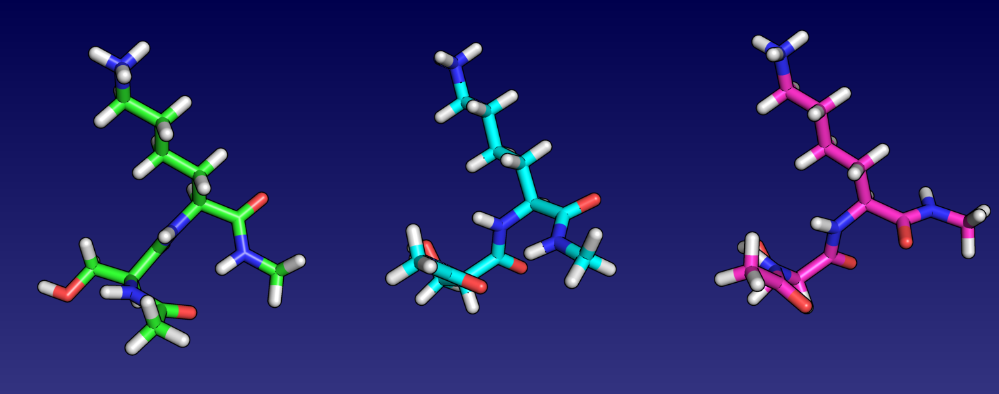

# Example 2 - Free energy basin-hopping

As temperature rises, entropy plays an increasing role in determining structural stability. To study this effect, we calculate the local free energy associated with
minima on the potential energy surface using the harmonic superposition approach. This is referred to as **free energy** basin-hopping.

In this example we will perform free energy basin-hopping for the SER-LYS dipeptide at two temperatures. We will also look back at [Example 1](../01_Basin-hopping_with_GMIN)
and compare what we find to the results when entropy was not considered.

## Requirements
In order to successfully follow this example, the following needs to be in your *PATH*:
- an **A9GMIN** binary

## Directory contents
This directory, and the backup you can find in the *./input* *./input_igb2* subdirectory contains all the files you need to run **A9GMIN** for SER-LYS.
The *./expected_output* subdirectory contains output from a succesful **A9GMIN** run to give you an idea of what you will be producing, although your output may differ slightly.

### GMIN input files

- *data* -		Some input files are optional, but every **GMIN** job requires a *data* file containing the keywords used to specify 
			how the run should proceed 
		
- *data_annotated* -	The keywords we are using in this example are detailed in *data_annotated*. While this file is not required to run **GMIN**, it is
			provided for reference. For information on the full set of keywords available, check the [GMIN website](http://www-wales.ch.cam.ac.uk/GMIN)

- *coords.prmtop* -	The symmetrised (see the note below!) **AMBER** topology file for SER-LYS using parameters from the **AMBER** ff99SB force field

- *coords.inpcrd* -  	The starting coordinates for the SER-LYS atoms in our system in **AMBER** restart format

- *min.in* -		The **AMBER** force field parameters to use to calculate the energy and gradient. 

- *min.in_annotated* -	Not used during the run. Contains additional information about the **AMBER** parameters used in this exammple. See the **AMBER** manual for more information

- *atomgroups* -	Defines the rotatable groups for the `GROUPROTATION` **GMIN** keyword, used to generate new configurations during basin-hopping

- *atomgroups_annotated* - Describes how the `GROUPROTATION` groups are defined. See the [GMIN documentation](http://www-wales.ch.cam.ac.uk/GMIN) for more examples

**IMPORTANT NOTE:** the **AMBER** and **CHARMM** force fields are not symmetrised with respect to permutational isomerisation! This is particularly troublesome for methods 
like these which rely partially on the energy to discriminate between minima. Without proper symmetrisation, permutational isomers (e.g. rotated methyl groups) can have different 
energies, resulting in 'twinning' of minima. 

For **AMBER** we resolve this by symmetrising the problem improper dihedral angles in the topology file after creating it using a Python script. You can find the script in the 
source code here:

```
SCRIPTS/AMBER/symmetrise_prmtop/perm-prmtop.ff03.py
```

Despite being labelled `ff03` - this script is also works for the ff99SB force field. For more details, see the script and the paper discussing this issue
[here](http://onlinelibrary.wiley.com/doi/10.1002/jcc.21425/abstract).

In this example, we have symmetrised the topology files for you. If you are ever unsure about your input, exchange the coordinates of what should be two identical atoms and
check that the energy does not change.

### Utility files

- *plot_progress.plt* -	A **gnuplot** input file that we will use to check how the various energy measures changed during the basin-hopping run

## Step-by-step

Before you start producing output, take a minute to look through *data_annotated* and make sure you understand roughly the purpose of each keyword. Pay special attention to the 
keywords that were not used in [Example 1](../01_Basin-hopping_with_GMIN), namely `FEBH` and `MIN_ZERO_SEP`.

The *data* file is initially set up for an `FEBH` temperature (distinct from the sampling `TEMPERATURE`) of 0.2 kcal/mol = 100.8K. 

### Running A9GMIN

Assuming you have a **A9GMIN** binary somewhere in your *PATH*, starting the basin-hopping run is as simple as executing it in the directory containing the input files:
```
A9GMIN &
```

The output can then be view as follows:

```
tail -f output
```

IF you would like to only see the 'quenches', you can filter this using `grep`:

```
tail -f output | grep Qu
```

Although SER-LYS is a relatively small system, we are diagonalising the Hessian every step and so this could take a bit of time to run... 

Because the contents of the *output* file for free energy basin-hopping is so similar to that for standard basin-hopping we covered in [Example 1](../01_Basin-hopping_with_GMIN) we 
will not cover it in detail.

One important difference to note is that when the final quenches are printed, the free energies are given as both absolute values and relative to the lowest free energy minimum 
found:

```
Final Quench      1 energy=     50.95105524     steps=   76 RMS force=  0.9952739E-08 time=       73.40
Final Quench      2 energy=     51.00541020     steps=   90 RMS force=  0.8708636E-08 time=       73.43
Final Quench      3 energy=     51.66211600     steps=   61 RMS force=  0.8180983E-08 time=       73.46
...
Final Quench     20 energy=     52.55657020     steps=   54 RMS force=  0.8861317E-08 time=       73.98
After re-sorting, the lowest found minima are (lowest free energy subtracted if applicable):
Lowest Minimum      1 Energy=      0.000000000
Lowest Minimum      2 Energy=     0.5435495577E-01
Lowest Minimum      3 Energy=     0.7110607618
...
```

It is the relative free energies that will appear in the *lowest* file:

```
          45
Energy of minimum      1=     0.000000000     first found at step       58 after                19519 function calls
HH31       -2.7958749515       -2.5952609373       -3.1617024780
CH3        -2.3553734829       -1.6074586870       -3.0298850959
HH32       -2.8767225384       -0.8909619190       -3.6642361483
```

In addition to the standard **A9GMIN** output files that are produces, the file *free_energy* contains a concise summary of each quench, breaking out the potential energy and
giving timing information:

```
      Quench         Potential energy     Harmonic term        Free energy        Markov energy            Time
 ------------------  ------------------  ------------------  ------------------  ------------------  ------------------
           0          -69.029146193808    121.438812526467     52.409666332659  ******************                 0.1
           2          -68.413036332963    121.439233480901     53.026197147938     52.409666332659                 0.3
           3          -67.645916314469    121.411048435983     53.765132121514     53.026197147938                 0.5
...
         500          -69.591427342571    121.293295483783     51.701868141212     51.701868866219                73.4
F          1          -70.132742641686    121.083797883653     50.951055241967     51.701868141212                73.4
F          2          -70.259825853665    121.265236051398     51.005410197733     51.701868141212                73.4
F          3          -69.454336154515    121.116452158316     51.662116003802     51.701868141212                73.5
F          4          -69.591430265579    121.293296023998     51.701865758419     51.701868141212                73.5
...
```

This includes the final quenches that are included in the *lowest* file, indicated by an `F` on the far left above.

### Comparing the lowest free and potential energy minimua using VMD


As we found the global potential energy minimum for SER-LYS in [Example 1](../01_Basin-hopping_with_GMIN), we can load it with **VMD** to compare against the lowest 
free energy minimum found here:

```
vmd -parm7 coords.prmtop -rst7 ../01_Basin-hopping_with_GMIN/expected_output/min1.1.rst -rst7 min1.1.rst
```

This will load the potential and free energy (at 100.8K) global minima into a pseudo trajectory. To align them and make structural comparison easy, navigate to the 
`Extensions > Analysis > RMSD Trajectory Tool` and click `RMSD` followed by `Align`. 

When you now drag the slider in the 'VMD Main' window you should see that the major difference between the global potential and free energy
minima at 100.8K is the orientation of the serine sidechain.

### The effect of raising the temperature

As we raise the temperature, entropic contributions to the free energy become more important - so much so that the global free energy minimum can change. 
To investigate this, we increase the `FEBH` temperature to 0.6 kcal/mol = 302.4K. To do this we need to create a new working directory to run **A9GMIN** in so that
we don't overwrite our existing output, then copy in the required input files:

```
mkdir FEBH0.6
cp input/* FEBH0.6
cd FEBH0.6
```

In order to change the `FEBH` temperature, we need to uncomment/comment the appropriate lines in the *data* file so it contains the following:

```
! 0.2 = 100.8K
! FEBH 0.2
! alternative FEBH temperature to try
! 0.6 = 302.4K
FEBH 0.6
``` 

We now run **A9GMIN** as before:

```
A9GMIN &
tail -f output | grep Qu
```

When the run completes, compare the *free_energy* output file to that produced when using `FEBH 0.2` originally. The first five final quenches from each should look
similar to the below:


**FEBH 0.2** (original)
```
F          1          -70.132742641686    121.083797883653     50.951055241967     51.701868141212                73.4
F          2          -70.259825853665    121.265236051398     51.005410197733     51.701868141212                73.4
F          3          -69.454336154515    121.116452158316     51.662116003802     51.701868141212                73.5
F          4          -69.591430265579    121.293296023998     51.701865758419     51.701868141212                73.5
F          5          -69.591667558088    121.308925593438     51.717258035349     51.701868141212                73.6
...
```

**FEBH 0.6** (new)
```
F          1          -67.824735491641    275.836948265714    208.012212774074    208.772287367176                75.3
F          2          -70.132739747475    278.218802786771    208.086063039296    208.772287367176                75.3
F          3          -68.700666537332    276.985067455812    208.284400918480    208.772287367176                75.3
F          4          -67.434171329499    275.723431683199    208.289260353700    208.772287367176                75.3
F          5          -69.612016553637    277.955546792754    208.343530239117    208.772287367176                75.3
...
```

The first thing to notice here is that the harmonic term and free energy are much higher at 302.4K. 

We also see that the potential energy for the lowest free energy minimum has changed from -70.13 to -67.82 kcal/mol, suggesting that the structure of the
global free energy minimum has changed after we raised the temperature. We can confirm this by using **VMD** again and aligning the structures before with the 
'RMSD Trajectory Tool' as before:

```
vmd -parm7 coords.prmtop -rst7 ../min1.1.rst -rst7 min1.1.rst
```

Due to the order in which we load the structures, frame 0 (the first structure) will correspond to the `FEBH 0.2` global free energy minimum. Looking at the difference between these
two structures, can you suggest why the second (from `FEBH 0.6`) may be more entropically stabilised?

You can see a comparison of (from left to right) the global potential energy and free energy minima at 100.8 (`FEBH 0.2)` and 302.4K (`FEBH 0.6`) respectively. 


## Extension: what about lowering the `FEBH` temperature?

Given that 1 kcal/mol = 504K, copy and edit the original input into new directories and run **A9GMIN** for some lower temperatures. Does the global free energy minimum change 
again at any point? 

If not - raise the temperature! Go crazy!  
