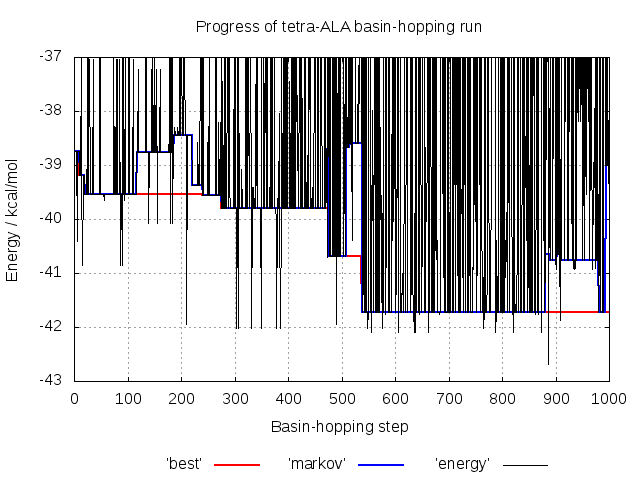

# Example 1 - Basin-hopping with GMINi


**GMIN** aims to efficiently locate the global minimum of a system by employing the basin-hopping global optimisation methodology. **A9GMIN** is simply a version of **GMIN**
that is interfaced to the **AMBER 9** potential. Here we use it to find the ten lowest energy minima for the tetra-ALA peptide (ALA-ALA-ALA-ALA). 

## Requirements
In order to successfully follow this example, the following needs to be in your *PATH*:
- an **A9GMIN** binary

## Directory contents
This directory, and the backup you can find in the *./input_vacuum* and *./input_igb2* subdirectories, contain all the files you need to run **A9GMIN** for tetra-ALA both
*in vacuo* and using a Generalised Born implicit solvent model.
The *./expected_output* subdirectories contain output from  succesful **A9GMIN** runs to give you an idea of what you will be producing, although your output may differ slightly.

### GMIN input files

- *data* -		Some input files are optional, but every **GMIN** job requires a *data* file containing the keywords used to specify 
			how the run should proceed 
		
- *data_annotated* -	The keywords we are using in this example are detailed in *data_annotated*. While this file is not required to run **GMIN**, it is
			provided for reference. For information on the full set of keywords available, check the [GMIN website](http://www-wales.ch.cam.ac.uk/GMIN)

- *coords.prmtop* -	The symmetrised (!) **AMBER** topology file for tetra-ALA using parameters from the **AMBER** ff99SB force field

- *coords.inpcrd* -  	The starting coordinates for the tetra-ALA atoms in our system in **AMBER** restart format

- *min.in* -		The **AMBER** force field parameters to use to calculate the energy and gradient. 

- *min.in_annotated* -	Not used during the run. Contains additional information about the **AMBER** parameters used in this exammple. See the **AMBER** manual for more information

- *atomgroups* -	Defines the rotatable groups for the `GROUPROTATION` **GMIN** keyword, used to generate new configurations during basin-hopping

- *atomgroups_annotated* - Describes how the `GROUPROTATION` groups are defined. See the [GMIN documentation](http://www-wales.ch.cam.ac.uk/GMIN) for more examples

**IMPORTANT NOTE:** the **AMBER** and **CHARMM** force fields are not symmetrised with respect to permutational isomerisation! This is particularly troublesome for methods 
like these which rely partially on the energy to discriminate between minima. Without proper symmetrisation, permutational isomers (e.g. rotated methyl groups) can have different 
energies, resulting in 'twinning' of minima. 

For **AMBER** we resolve this by symmetrising the problem improper dihedral angles in the topology file after creating it using a Python script. You can find the script in the 
source code here:

```
SCRIPTS/AMBER/symmetrise_prmtop/perm-prmtop.ff03.py
```

Despite being labelled `ff03` - this script is also works for the ff99SB force field. For more details, see the script and the paper discussing this issue
[here](http://onlinelibrary.wiley.com/doi/10.1002/jcc.21425/abstract).

In this example, we have symmetrised the topology files for you. If you are ever unsure about your input, exchange the coordinates of what should be two identical atoms and
check that the energy does not change.

### Utility files

- *plot_progress.plt* -	A **gnuplot** input file that we will use to check how the various energy measures changed during the basin-hopping run

## Step-by-step

Before you start producing output, take a minute to look through *data_annotated* and make sure you understand roughly the purpose of each keyword. You will find
some keywords are commented out, starting with ' !'. The input initially in the directory uses a Generalised Born implicit solvent (see `min.in_annotated`). 

### Running A9GMIN

Assuming you have a **A9GMIN** binary somewhere in your *PATH*, starting the basin-hopping run is as simple as executing it in the directory containing the input files:
```
A9GMIN &
```

The output can then be view as follows:

```
tail -f output
```

IF you would like to only see the 'quenches', you can filter this using `grep`:

```
tail -f output | grep Qu
```

As tetra-ALA is a relatively small system, this won't take too long to finish and will produce a few output files that we will look at in more detail. 

First is *output*, containing a lot of information on how the job progressed. The basin-hopping procedure in **GMIN** can be broken down into three phases:

1. Initial quench (Qu) and first basin-hopping steps


```
Calculating initial energy
Qu          0 E=    -38.74735094     steps=  702 RMS= 0.98789E-04 Markov E=    -38.74735094     t=        0.3
 mc> Storing cis/trans information for initial structure
Starting MC run of       1000 steps
Temperature will be multiplied by      1.00000000 at every step
Qu          1 E=    -38.74735089     steps=  504 RMS= 0.93933E-04 Markov E=    -38.74735094     t=        0.5
Qu          2 E=    -38.74735094     steps=  481 RMS= 0.89655E-04 Markov E=    -38.74735089     t=        0.7
Qu          3 E=    -38.74735089     steps=  484 RMS= 0.93396E-04 Markov E=    -38.74735094     t=        0.9
```

The input coordinates (here in the file *coords.inpcrd*) are read in and the system is ‘quenched’ to a local minimum, giving you ‘Qu 0’ which forms the first structure 
in a Markov chain of states. **GMIN** then begins to take basin-hopping steps. A new geometry is generated according to the keywords we are using and is quenched. 
The outcome of a Metropolis test using the energy of the current Markov minimum and `TEMPERATURE` specified in *data* then determines whether we accept the new 
minimum into the Markov chain or not. If it was accepted, this minimum will be used as a starting point from which to generate the next new geometry, otherwise we 
base it on the previous step.
 
2. First `GROUPROTATION` step and a chirality inversion

As we have `GROUPROTATION 5` in our *data* file, every 5 steps we rotate a random selection of groups as defined in *atomgroups* according to their selection probabilities
and maximum rotational amplitudes. This is a large step and can cause significant disruption to the structure of our system. In this case, we see that the C-alpha of ALA4 has
been inverted! As a result, **GMIN** rejects this quench, even though the energy is significantly lower than the current Markov energy:

```
Qu          4 E=    -38.74735079     steps=  488 RMS= 0.83044E-04 Markov E=    -38.74735089     t=        1.1
 GROUPROTATION> Rotating group CTER by    131.42007682883846
 GROUPROTATION> Rotating group ALA1 by    127.75526578933935
 GROUPROTATION> Rotating group ALA3 by    100.73172081786208
 GROUPROTATION> Rotating group ALA4 by   -24.320459851830947
 GROUPROTATION> Rotating group NTER by   -70.057293974787598
check_chirality> ERROR -- inverted chiral carbon detected in residue      4
  quench> CHIRALITY CHECK FAILED - discarding structure
Qu          5 E=    -40.40419870     steps=  696 RMS= 0.78655E-04 Markov E=    -38.74735079     t=        1.3
```

We will look at this in more detail in the next example.

3. `STEP` size adjustment to satisfy target acceptance ratio
```
Qu         50 E=    -39.54147772     steps=  611 RMS= 0.95547E-04 Markov E=    -39.54147774     t=       12.6
Acceptance ratio for previous     50 steps=  0.8400  FAC=  1.0500
Steps are now:  STEP=    1.0500 Temperature is now:    1.0000
Qu         51 E=    -39.54147774     steps=  619 RMS= 0.77208E-04 Markov E=    -39.54147772     t=       12.8
```

Every 50 quenches, we compare the acceptance ratio for the Metropolis test to that we are hoping to attain (0.5 by default) and scale the size of the change we 
are making - here random Cartesian perturbations, applied to all particles, of maximum size specified by `STEP` and rotations of groups of atoms by `GROUPROTATION` as defined in 
*atomgroups* - to generate new geometries to move toward the target ratio.

3. Final quenches and file output
```
Final Quench      1 energy=    -41.72299240     steps=  233 RMS force=  0.8646050E-06 time=      251.17
Final Quench      2 energy=    -40.75329850     steps=  189 RMS force=  0.8797289E-06 time=      251.25
Final Quench      3 energy=    -40.67918375     steps=  162 RMS force=  0.8797333E-06 time=      251.31
Final Quench      4 energy=    -40.64488431     steps=  302 RMS force=  0.9997832E-06 time=      251.43
Final Quench      5 energy=    -39.79992724     steps=  147 RMS force=  0.9632286E-06 time=      251.49
Final Quench      6 energy=    -39.55711402     steps=  195 RMS force=  0.9973382E-06 time=      251.56
Final Quench      7 energy=    -39.54147777     steps=  239 RMS force=  0.9132704E-06 time=      251.66
Final Quench      8 energy=    -39.44864176     steps=  264 RMS force=  0.7431839E-06 time=      251.78
Final Quench      9 energy=    -39.44390506     steps=  178 RMS force=  0.9534599E-06 time=      251.85
Final Quench     10 energy=    -39.37804819     steps=  298 RMS force=  0.9171114E-06 time=      251.96
```

Finally, after we have done the number of `STEPS` specified in *data*, or have found the `TARGET` - the `SAVE` lowest energy minima found are tightly converged 
and written to the *lowest* file in XYZ format:

```
          52
Energy of minimum      1=    -41.72299240     first found at step      538 after               333119 function calls
HH31       -3.4746773684        2.7763940219        2.0558942538
CH3        -2.9883377528        2.7394232415        1.0819184398
HH32       -3.7445924654        2.7264384069        0.2980544502
HH33       -2.3494126657        3.6132494028        0.9594341206
C          -2.1521596792        1.4856627242        0.9908834873
O          -0.9408712696        1.5620435015        0.7927014803
N          -2.7960024638        0.3244150875        1.1078193060
H          -3.7935556138        0.3518998024        1.2647472465
CA         -2.1333825586       -0.9859624511        1.1306528777
HA         -1.4387686196       -1.0043606720        1.9716866393
CB         -3.2061795753       -2.0542544523        1.3786678089
HB1        -2.7360937942       -3.0363172100        1.4489224609
...
```

### Visualising the progress of the basin-hopping run using gnuplot


To give us an idea of how **GMIN** is performing with the parameters we have specified in *data*, we have included the `TRACKDATA` keyword. The *best*, *markov* 
and *energy* files it produces can be visualised with gnuplot:
```
gnuplot -persist plot_progress.plt
```

The energy of each quenched minimum is shown in black. Blue shows the energy of the structure in the Markov chain (used to generate new geometries) and red 
shows the energy of the lowest energy minimum. 

Here you can see the energy of some quenches spikes well above the Markov energy, corresponding to unphysical structures
which are automatically rejected.

Interestingly you also see the energy dip below the Markov and best energy - why? These energies correspond to structures with inverted C-alpha atoms giving the ALA residues
the 'wrong' chirality. These are rejected by **GMIN**'s chirality checks, something we will look at in more detail in the next example! 

### Visualising the lowest energy minimum with VMD

**GMIN** produces PDB and **AMBER** restart files for biological systems which you can load one at a time using **VMD** as follows for the lowest energy minimum found:

- from the .pdb files
```
vmd -pdb lowest1.1.pdb
```

- from the .rst files
```
vmd -parm7 coords.prmtop -rst7 min1.1.rst
```

Here we load the coordinates from the .rst file into the molecular topology we load from the **AMBER** topology file *coords.prmtop*. 
We can also view all of our saved minima as a pseudo trajectoory by directly loading the *lowest* file:

```
vmd -parm7 coords.prmtop -xyz lowest
```

Here frame 0 is the lowest energy minimum with the energy rising along the 'trajectory'. Because **VMD** considers this a trajectory, you can use the 'RMSD Trajectory Tool' as you
would for MD to align the minima, making it easy to compare them.

## Extension: comparing the minima found *in vacuo*

As a learning exercise, it is interesting to investigate the effect of removing the implicit solvent and re-running **A9GMIN** for tetra-ALA *in vacuo*. The input to do this can
be copied from the *input_vacuum* subdirectory.

It is recommended thar you create a new directory to run this in so that once you are finished you an compare the minima you find *in vacuo* to those found when using the
Generalised Born implicit solvent.

Finally, given your knowledge of the charge shielding effect of solvent, do the difference you see make chemical sense? 
