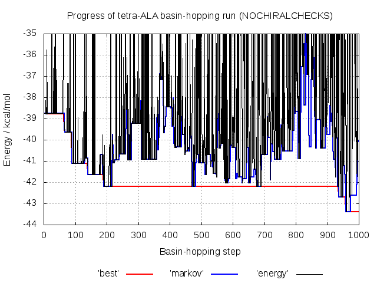
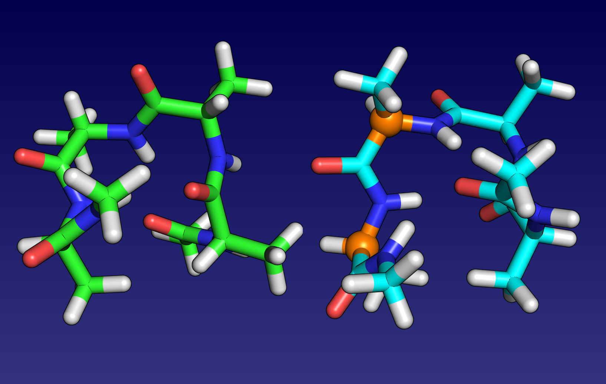

# Example 1 - Removing the chirality checks

Many amino acids are chiral and the vast majority found in proteins are in the so called L-form e.g. L-ALA. Unlike in molecular dynamics, it is quite possible that during a
basin-hopping run we invert a chiral centre while exploring the energy landscape. In this case, the C-alpha atoms in tetra-ALA could invert to give D-ALA residues. 

By default, as we wish to only explore the space of L amino acids, **A9GMIN** checks to ensure that all residues are still L rather than the mirror image D-form
before considering a new minimum for acceptance into the Markov chain. 

However using common molecular mechanics force fields like **AMBER** and disabling these checks, we can see that sometimes a mixture of L and D amino acids can actually be lower in
potential energy than a purely L structure. We will investigate this here by comparison to Example 1 by explicitly disabling the chirality checks with the `NOCHIRALCHECKS` in the
**GMIN** *data* file.

## Requirements
In order to successfully follow this example, the following needs to be in your *PATH*:
- an **A9GMIN** binary

## Directory contents
This directory, and the backup you can find in the *./input_vacuum* and *./input_igb2* subdirectories, contain all the files you need to run **A9GMIN** for tetra-ALA both
*in vacuo* and using a Generalised Born implicit solvent model.
The *./expected_output* subdirectories contain output from  succesful **A9GMIN** runs to give you an idea of what you will be producing, although your output may differ slightly.

### GMIN input files

- *data* -		Some input files are optional, but every **GMIN** job requires a *data* file containing the keywords used to specify 
			how the run should proceed 
		
- *data_annotated* -	The keywords we are using in this example are detailed in *data_annotated*. While this file is not required to run **GMIN**, it is
			provided for reference. For information on the full set of keywords available, check the [GMIN website](http://www-wales.ch.cam.ac.uk/GMIN)

- *coords.prmtop* -	The symmetrised (see the note below!) **AMBER** topology file for tetra-ALA using parameters from the **AMBER** ff99SB force field

- *coords.inpcrd* -  	The starting coordinates for the tetra-ALA atoms in our system in **AMBER** restart format

- *min.in* -		The **AMBER** force field parameters to use to calculate the energy and gradient. 

- *min.in_annotated* -	Not used during the run. Contains additional information about the **AMBER** parameters used in this exammple. See the **AMBER** manual for more information

- *atomgroups* -	Defines the rotatable groups for the `GROUPROTATION` **GMIN** keyword, used to generate new configurations during basin-hopping

- *atomgroups_annotated* - Describes how the `GROUPROTATION` groups are defined. See the [GMIN documentation](http://www-wales.ch.cam.ac.uk/GMIN) for more examples

**IMPORTANT NOTE:** the **AMBER** and **CHARMM** force fields are not symmetrised with respect to permutational isomerisation! This is particularly troublesome for methods 
like these which rely partially on the energy to discriminate between minima. Without proper symmetrisation, permutational isomers (e.g. rotated methyl groups) can have different 
energies, resulting in 'twinning' of minima. 

For **AMBER** we resolve this by symmetrising the problem improper dihedral angles in the topology file after creating it using a Python script. You can find the script in the 
source code here:

```
SCRIPTS/AMBER/symmetrise_prmtop/perm-prmtop.ff03.py
```

Despite being labelled `ff03` - this script is also works for the ff99SB force field. For more details, see the script and the paper discussing this issue
[here](http://onlinelibrary.wiley.com/doi/10.1002/jcc.21425/abstract).

In this example, we have symmetrised the topology files for you. If you are ever unsure about your input, exchange the coordinates of what should be two identical atoms and
check that the energy does not change.

### Utility files

- *plot_progress.plt* -	A **gnuplot** input file that we will use to check how the various energy measures changed during the basin-hopping run

## Step-by-step

Before you start producing output, take a minute to look through *data_annotated* and make sure you understand roughly the purpose of each keyword. You will find
some keywords are commented out, starting with ' !'. The input initially in the directory uses a Generalised Born implicit solvent (see `min.in_annotated`). 

The input is almost identical to that in Example 1 apart from the addition of the `NOCHIRALCHECKS` keyword.

### Running A9GMIN without chirality checks

Assuming you have a **A9GMIN** binary somewhere in your *PATH*, starting the basin-hopping run is as simple as executing it in the directory containing the input files:
```
A9GMIN &
```

The output can then be view as follows:

```
tail -f output
```

IF you would like to only see the 'quenches', you can filter this using `grep`:

```
tail -f output | grep Qu
```

tetra-ALA is a relatively small system, this won't take too long to finish! 

As the input for this example is almost identical to that for Example 1, we will not cover the details of the **A9GMIN** output files here, other than to note that you will
**not** see the `check_chirality> ERROR -- inverted chiral carbon detected in residue X` this time as the checks have been disabled.

### Visualising the progress of the basin-hopping run using gnuplot


To give us an idea of how **GMIN** is performing with the parameters we have specified in *data*, we have included the `TRACKDATA` keyword. The *best*, *markov* 
and *energy* files it produces can be visualised with gnuplot:
```
gnuplot -persist plot_progress.plt
```

The energy of each quenched minimum is shown in black. Blue shows the energy of the structure in the Markov chain (used to generate new geometries) and red 
shows the energy of the lowest energy minimum. 

As in Example 1, you can see that the energy of some quenches spikes well above the Markov energy, corresponding to unphysical structures which are automatically rejected.

However, unlike Example 1 where we imposed the chirality checks, you do **not** see the energy dip below the Markov and best energy. This is because we are now accepting these
lower energy mixed L/D structures into the Markov chain. 

Importantly we see that the energy of the putative global minimum is lower at -43.378 kcal/mol when we allow a mixture of L and D alanine residues as compared to the purely
L-ALA structure found previously at -41.723 kcal/mol.

### Visualising the mixed L/D global minimum with **VMD**


We can load the structure of the lowest energy minimum into VMD using the *lowests1.1.pdb* file produced by **A9GMIN**:

```
vmd -pdb lowest1.1.pdb
```

It is hard to see the difference between the L and D forms of alanine unless you know what to look for. Helpfully **VMD** has a plugin to do the hard work for us. Navigate to the
`Extensions > Modelling > Fix Chirality Errors` plugin via the menu and click the `Check structure` button. You will see that **VMD** has identified that the C-alpha centres of 
residues 'ALA 2' and 'ALA 5' seem to be inverted. As **VMD** is counting our N-terminal `ACE` capping group as a residue, this actually corresponds to residues 1 and 4. 

If you click on one of the residue lines and then click the 'Show selected chiral centre' button, you can take a closer look at the affected centres. 

If you're curious, see if you can see the atom ordering difference around the C-alpha atom as compared to the pure L global minimum. A good starting point is to rotate the view to
look straight down a bond in each case and count the order of atoms in a clockwise direction in both cases. 


## Extension: does the same happen if we allow cis-peptide bonds?

In addition to repeating the above using the *in vacuo* input in the *input_vacuum* subdirectory - it might be interesting to see what happens if we relax another of **GMIN**'s 
checks - the restriction that all peptide bonds (other than for proline) must be 'trans', i.e with the N-H and C=O bonds pointing in opposite directions.

To check, add the `CISTRANS` keyword to your *data* file and re-run **A9GMIN**. Take a look at the lowest energy minima found by loading the *lowest* file using **VMD** and see
if the peptide bonds are still trans!

As a reminder, you can easily load the `SAVE` lowest energy minima found as follows:

```
vmd -parm7 coords.prmtop -xyz lowest
```
