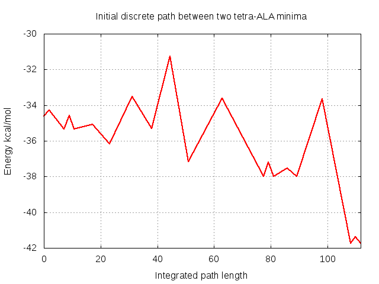

# Example 3 - Connecting minima with OPTIM

Among many other things, **A12OPTIM** can construct discrete paths: sequences of minima and transition states between two specified minima termed ‘endpoints’. Here we 
take two low energy minima that were identified using **A12GMIN** in [Example 1](../01_Basin-hopping_with_GMIN) and connect them. This can give us information about 
the barriers between them and the rate of interconversion. 

**NOTE:** As with **A12GMIN**, **A12OPTIM** is simply a version of **OPTIM** that has access to the **AMBER** potential.

## Requirements
In order to successfully follow this example, the following need to be in your *PATH*:

- an **A12OPTIM** binary

## Directory contents
Both this directory and the backup in *./input* contain all the files you need to run **OPTIM** to connect two tetra-ALA minima. The *./expected_output* subdirectory 

contains output from a succesful **OPTIM** run to give you an idea of what you will be producing. Note that your output may differ!

### OPTIM input files

- *odata* -		Some input files are optional, but every **A12OPTIM** job requires an *odata* file containing the keywords used to specify 
			what we would like the run to achieve. 
		
- *odata_annotated* -	The keywords we are using in this example are detailed in *odata_annotated*. While this file is not required to run **OPTIM**, it is
			provided for reference. For information on the full set of keywords available, check the [OPTIM website](http://www-wales.ch.cam.ac.uk/OPTIM)

- *coords.prmtop* -	The symmetrised (see the note below!) **AMBER** topology file for tetra-ALA using parameters from the **AMBER** ff99SB force field

- *coords.inpcrd* -  	Coordinates for the tetra-ALA atoms in our system in **AMBER** restart format. These are only used to allocate arrays during setup and the coordinates
			themselves are overwritten with those in *start* (below)

- *start* -		The (x,y,z) coordinates for the first 'endpoint' - in this case the higher energy of the two tetra-ALA minima

- *finish* -		The (x,y,z) coordinates for the second 'endpoint' - in this case the global minimum for the pure L-ALA form	 

- *min.in* -		The **AMBER** force field parameters to use to calculate the energy and gradient. 

- *min.in_annotated* -	Not used during the run. Contains additional information about the **AMBER** parameters used in this exammple. See the **AMBER** manual for more information

- *perm.allow* - 	Specifies which atoms in tetra-ALA should be considered identical with respect to permutational isomerisation. This ensures that we do not consider two minima
			that differ by a rotation of a methyl group to be different. It is possible to generate these files automatically from a PDB using the Python script here:

```
SCRIPTS/make_perm.allow/perm-pdb.py file.pdb AMBER 
```

This script does not treat capping groups such as ACE and NME which will need to be added manually.

- *perm.allow_annotated* - Contains details of how the *perm.allow* groups are constructed. For more information, see the [OPTIM website](http://www-wales.ch.cam.ac.uk/OPTIM)   


**IMPORTANT NOTE:** the **AMBER** and **CHARMM** force fields are not symmetrised with respect to permutational isomerisation! This is particularly troublesome for methods 
like these which rely partially on the energy to discriminate between minima. Without proper symmetrisation, permutational isomers (e.g. rotated methyl groups) can have different 
energies, resulting in 'twinning' of minima. 

For **AMBER** we resolve this by symmetrising the problem improper dihedral angles in the topology file after creating it using a Python script. You can find the script in the 
source code here:

```
SCRIPTS/AMBER/symmetrise_prmtop/perm-prmtop.ff03.py
```

Despite being labelled `ff03` - this script is also works for the ff99SB force field. For more details, see the script and the paper discussing this issue
[here](http://onlinelibrary.wiley.com/doi/10.1002/jcc.21425/abstract).

In this example, we have symmetrised the topology files for you. If you are ever unsure about your input, exchange the coordinates of what should be two identical atoms and
check that the energy does not change.

### Utility files

- *plot_pathway.plt* - 	**gnuplot** input file to plot the energy of states along the pathway as a function of integrated path length

## Step-by-step

Before you start producing output, take a minute to look through *odata_annotated* and make sure you understand roughly the purpose of each keyword.  

### Generating an initial discrete path using A12OPTIM

Assuming you have the binary somewhere in your *PATH*, running **A12OPTIM** and following the output is as simple as this:

```
A12OPTIM > optim.out & 
tail -f optim.out
```

The **A12OPTIM** output file we have created, *optim.out*, can be broken down into sections as follows:

#### Check endpoints and reoptimise if needed
It is possible that the endpoint structures you supply are not converged to a tight enough RMS force to satisfy the `BFGSCONV` value specified in *odata*. In this
case, **A12OPTIM** first tightly minimises them:
```
 OPTIM> Initial energy=    -34.60220758     RMS force=    0.3103087097E-04
 OPTIM> Final energy  =    -41.72299240     RMS force=    0.3117591169E-04
OPTIM> Bad endpoints supplied - RMS force too big!
OPTIM> Acceptable RMS force would be less or equal to     0.1000000000E-05
 mylbfgs> Resetting LBFGS minimiser
 mylbfgs> Energy and RMS force=    -34.60220758        0.3103087097E-04 after      0 steps
 mylbfgs> Energy and RMS force=    -34.60220758        0.2827417733E-04 after      1 steps, step:  0.15021E-07
```
Once both have been optimised, the final energies of the endpoints are printed. This will be useful when we want to identify them in 
[Example 4](../04_Creating_PATHSAMPLE_database).
```
geopt>                          **** CONVERGED ****

 OPTIM> Initial energy=    -34.60220758     RMS force=    0.8612671412E-06
 OPTIM> Final energy  =    -41.72299240     RMS force=    0.8757805512E-06
```
#### Perform connection cycles to find a sequence of minima and transition states that form a connected pathway
**OPTIM** forms a connected pathway through a series of 'CONNECT' cycles as defined by the `NEWCONNECT` keyword in *odata*. Each connection cycle can be further
broken down as follows:

- Use a Dijkstra analysis to identify gaps in the pathway and select minima to connect
```
>>>>>>>>>>>>>>>>>>>>> CONNECT CYCLE 1 >>>>>>>>>>>>>>>>>>>>> 2 minima and 0 ts are known >>>>>>>>>>>>>>>>>>>>
 decide> Shortest path in Dijkstra has      1 steps with      1 missing connections, weight=    0.15291E+11
 decide> The unconnected minima in the chain and their distances are:
     2       23.45     1
``` 

- Identify intervening transition states by finding initial candidates using the Doubly-Nudged Elastic Band (DNEB) approach from which true transition 
states are refined using a hybrid BFGS/eigenvector following approach and Rayleigh-Ritz minimisation. 
```
tryconnect> 600-iteration DNEB run for minima 1_S and 4_F using 30 images  (DNEB attempt #1)  ...
 lbfgs> Final DNEB force constant      70.39988712
 Time to go through NEB:    6.7840000000000007
 Double-ended search iterations= 600 RMS= 0.9798 Dev= 9.95% S= 30.00 time= 6.78
 Following    3 images are candidates for TS:   10   13   16
 Converged to TS (number of iterations):         17
 Converged to TS (number of iterations):         25
 Converged to TS (number of iterations):         25
 DNEB run yielded 3 true transition state(s) time=   4.78
 isnewts> transition state is the same as number        1 energy=      -34.5885397207
 tryconnect> Try the path again for ts      1 with pushoff=    0.1000000000E-01
 tryconnect> Transition state with energy      23.43708823     ignored
```

In this case you can see that although we found three new transition states, one was previously found and another was discarded as being unphyically high energy as specified by
`MAXTSENERGY` in *odata*.

- Find the minima connected to each transition state by stepping off along the steepest descent paths
```
>>>>>  Path run for ts 3 ...
 tryconnect> Trying this transition state path again with pushoff=    0.1000000000E-01
 Plus  side of path:                     750 steps. Energy=    -35.35034723       time=       0.39
 Minus side of path:                     830 steps. Energy=    -35.35034723       time=       0.34

         E+        Ets - E+           Ets       Ets - E-           E-          S       D      gamma   ~N
      -35.3503472 0.76181          -34.5885397 0.76181          -35.3503472   3.567   3.084  17.158   3.031
        Known (#3)                                              Known (#3)
```

All the minima and transition states found are considered at the start of the next cycle when running the Dijkstra analysis and this continues
until either we have exceeded the number of allowed connection cycles, run out of pairs of minima to connect or identified a connected pathway:

```
 Connected path found
  ts        E+         Ets - E+          Ets       Ets - E-          E-          S       D      gamma   ~N
   8      -34.6022076 0.33153         -34.2706748  1.0797         -35.3503472   7.114   6.733   6.224   8.355
   1      -35.3503472 0.76181         -34.5885397 0.76181         -35.3503472   3.567   3.083  17.177   3.027
  15      -35.3503472 0.27563         -35.0747126  1.0808         -36.1555294  12.519  12.134   1.798  28.915
  22      -36.1555294  2.6350         -33.5205243  1.7888         -35.3093212  14.861  14.007   1.677  31.006
  10      -35.3093212  4.0357         -31.2736332  5.9002         -37.1738337  12.977  12.343   1.864  27.901
  16      -37.1738337  3.5562         -33.6176191  4.3552         -37.9728100  26.405  19.733   4.189  12.413
   7      -37.9728100 0.76777         -37.2050443 0.76777         -37.9728100   3.551   3.085  17.013   3.056
   9      -37.9728100 0.45014         -37.5226724 0.45556         -37.9782297   8.136   7.260   1.824  28.505
  14      -37.9782297  4.3155         -33.6627077  8.0603         -41.7229924  18.939  16.325   3.161  16.449
  13      -41.7229924 0.36251         -41.3604830 0.36251         -41.7229924   3.566   3.079  17.056   3.049
```

#### Output the connected pathway and associated files
Once **OPTIM** has identified a connected pathway, it produces a set of output files including:
  - *path.info* containing the coordinates and Hessian eigenvalues of all the minima and transition states found (not just those along the 
final pathway) in min-ts-min triples. We will be using this file in [Example 4](../04_Creating_PATHSAMPLE_database)
  - *path.xyz* containing the coordinates of the minima and transition states along the pathway 
  - *EofS* containing the energy as a function of integrated path length

### Visualising the pathway using gnuplot

The initial pathway found by **OPTIM** can be relatively non-optimal, sometimes containing unphysically high barriers or structures. A sensible first sanity
check for any pathway is to look at how the energy varies along it. In this case, we can plot the energy as a function of the integrated path length (contained
in the *EofS* file) using **gnuplot**

```
gnuplot -persist plot_pathway.plt
```

It should look something like this:

 
### Examining the structures along the pathway using VMD

We often want to investigate the mechanism involved in the pathway between endpoints, something we can do visually in this case using **VMD** to load *path.xyz*:
```
vmd -parm7 coords.prmtop -xyz path.xyz
```

The **AMBER** topology file *coords.prmtop* is loaded to provide atom connectivity information that is missing in the *path.xyz* file.

When you drag the slider in the 'VMD Main' window from left to right, you will see the structure move from the minimum in *start* and the global minimum in *final*. If you are
paying attention, you might notice that some methyl groups appear to be spinning! Surely this isn't necessary?! 

The *path.info* file actually contains **all** minima and transition
states found during the **A12OPTIM** run, not just those on the initial discrete path between the endpoints. You will see in the next example that **PATHSAMPLE** sorts this out for
us.

## Extension: connecting the pure L and mixed L/D global minima

You would think that inverting two C-alpha centres to convert the pure L global minimum into the mixed L/D structure in Example 2 would be a high barrier process. To investigate,
take the coordinates for the mixed L/D structure and use them to replace those in the *start* file. Don't forget to convert them into (x,y,z) format.

Re-run **A12OPTIM** and see if you can make a connection. Visualise the initial path using **gnuplot** as before and see what the barriers look like!
