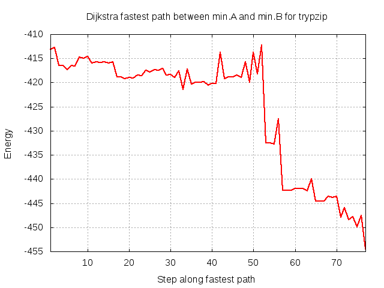
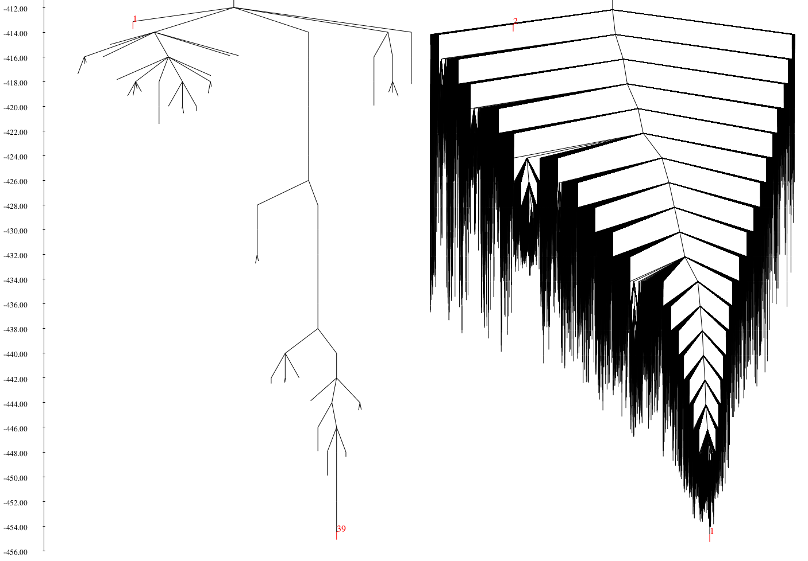

# Challenge: improving an initial trpyzip path


Before you attempt this challenge, it is *highly* recommended that you first run through the **OPTIM** and **PATHSAMPLE** examples for the tetra-ALA peptide [here](../tetra_ALA).

The 12 residue tryptophan zipper peptide has been extensively used as a model system for protein folding and force field benchmarking. The beta-hairpin it forms is stabilised by
the packing of four tryptophan rings in the native state, forming a 'steric zipper' motif. 

In this directory you will find a **PATHSAMPLE** database containing only the minima and transition states along an initial discrete path from an unfolded to the native state as
shown above. The pathway has not been at all optimised and as such is likely to be overly long and contain high barriers.

Your job is to expand this **PATHSAMPLE** database using a range of techniques (some of which are outlined in *pathdata_annotated*) to further sample the energy landscape of this
peptide, improving the fastest path and converging the folding rate as you go.

There are keywords in these input files that you will not necessarily have seen before so check them on the [PATHSAMPLE website](http://www-wales.ch.cam.ac.uk/PATHSAMPLE).

Unlike other examples, this challenge is not designed to be something you can complete in an hour so don't be discouraged!  

## Requirements
In order to successfully attempt this challenge, the following need to be in your *PATH*:

- a **PATHSAMPLE** binary
- an **A9OPTIM** binary
- a **disconnectionDPS** binary

## Directory contents
Both this directory and the backup in *./input* contain all the files you need to run **PATHSAMPLE** to expand the database 

As **PATHSAMPLE** acts as a driver for **A9OPTIM** (i.e. it starts **A9OPTIM** jobs), there are also **A9OPTIM** input files present.

### PATHSAMPLE input files

- *pathdata* -			Every **PATHSAMPLE** job requires a *pathdata* file containing the keywords used to specify what we would like the run to achieve.
				This example will require us to run it twice with different keywords, hence there are two sections at the bottom of
				*pathdata*, one initially commented out (starting with '! ')

- *pathdata_annotated* -	The **PATHSAMPLE** keywords we are using in this example are detailed in *pathdata_annotated*. This file is not required, it is
				provided for reference only. For information on the full set of **PATHSAMPLE** keywords available, check the
				[PATHSAMPLE website](http://www-wales.ch.cam.ac.uk/PATHSAMPLE)

- *min.A* -			Defines which minima should be considered part of the A group - the products or reactants depending on how we specify the `DIRECTION`
				in *pathdata*

- *min.B* -			Defines which minima should be considered part of the B group - the products or reactants depending on how we specify the `DIRECTION`
				in *pathdata*

- *perm.allow* - 	Specifies which atoms in trypzip should be considered identical with respect to permutational isomerisation. This ensures that we do not consider two minima
			that differ by a rotation of a methyl group to be different. It is possible to generate these files automatically from a PDB using the Python script here:

```
SCRIPTS/make_perm.allow/perm-pdb.py file.pdb AMBER 
```

- *perm.allow_annotated* - Contains details of how the *perm.allow* groups are constructed. For more information, see the [OPTIM website](http://www-wales.ch.cam.ac.uk/OPTIM)   


Both **PATHSAMPLE** and **A9OPTIM** need to be able to distinguish permutational isomers and so both require *perm.allow* to be present. 

### PATHSAMPLE database files

- *min.data* - 	Contains the energy, logarithm of the product of positive Hessian eigenvalues, symmetry and moments of inertia for each minimum. A minimum is identified by its
		line number in this file

- *ts.data* -	Contains the energy, logarithm of the product of positive Hessian eigenvalues, symmetry, minima numbers that it connects and moments of intertia for each
		transition state. A transition state is identified by its line number in this file

- *points.min* -	Contains the coordinates for each minimum in a binary format to keep the file size low

- *points.ts* -		Contains the coordinates for each transition state in the same binary format

### OPTIM input files

- *odata.connect* -		Contains the **A9OPTIM** keywords used for jobs started by **PATHSAMPLE**.
 
		
- *odata.connect_annotated* -	The **A9OPTIM** keywords present in *odata.connect* are detailed in *odata.connect_annotated*.
				For information on the full set of keywords available, check the [OPTIM website](http://www-wales.ch.cam.ac.uk/OPTIM)

- *coords.prmtop* -	The symmetrised (see the note below!) **AMBER** topology file for trypzip using parameters from the **AMBER** ff99SB force field

- *coords.inpcrd* -  	Coordinates for the trypzip atoms in our system in **AMBER** restart format. These are only used to allocate arrays during setup and the coordinates
			themselves are overwritten with those in *start.X* by **PATHSAMPLE** automatically as it starts **A9OPTIM** jobs in the next example

- *start* -		Placeholder trypzip coordinates that are also overwritten with those in *start.X* by **PATHSAMPLE**.

- *min.in* -		The **AMBER** force field parameters to use to calculate the energy and gradient. 

- *min.in_annotated* -	Not used during the run. Contains additional information about the **AMBER** parameters used in this exammple. See the **AMBER** manual for more information

- *perm.allow* - 	discussed above

- *perm.allow_annotated* - discussed above

### disconnectionDPS input files

- *dinfo* -			Contains the keywords that control the appearence of the disconnectivty graph produced when **disconnectionDPS** is run in the
				current directory

- *dinfo_annotated* -		The **disconnectionDPS** keywords used in this example are detailed in *dinfo_annotated*. For more information and a full
				keyword listing, see the top of the *disconnectionDPS.f90* source file, available in the source tar file on the
				[Wales Group website](http://www-wales.ch.cam.ac.uk)

## Getting started

Before you start, take a minute to look through *pathdata_annotated* and *odata.connect_annotated* and make sure you understand roughly the purpose of each keyword. 
You may also need to slightly alter your *pathdata* file to ensure that the `EXEC` keyword points to a valid **A9OPTIM** binary.

The **PATHSAMPLE** input in *pathdata* is initially set up to perform a Dijkstra analysis, returning the fastest path:


The first thing you need to do is decide which strategy you will use to select minima to connect to most efficiently expand the database. 

*pathdata* contains a range of options with the parameters intentionally left blank:

```
! STEP 2: decide on a strategy to expand the database
PAIRLIST 1
! DUMMYRUN

! Option A - SHORTCUT x
! SHORTCUT x
! CYCLES 10

! Option B - SHORTCUT x BARRIER
! SHORTCUT x BARRIER
! CYCLES 10

! Option C - UNTRAP einc thresh (edeltamin) (elowbar) (ehighbar)
! UNTRAP einc thresh (edeltamin) (elowbar) (ehighbar)
! CYCLES 10

! Option D - FREEPAIRS x1 x2 x3
! FREEPAIRS x1 x2 x3
! CYCLES 10

! Option E - CONNECTREGION min1 min2
! CONNECTREGION min1 min2
! CYCLES 10

! Option F - ADDPATH path.info.x
! ADDPATH path.info.toadd
! CYCLES 0

```

The approach you use and the parameters you choose should be informed by the system you are studying. Withoug giving too much away, here are a few tips:

- look at the initial path carefully - what are the barriers like?

- you can run **disconnectionDPS** at any time (remember `IDENTIFY`?) to make a disconnectivity graph and view it with `gv`

- if you want to manually connect two minima with **OPTIM** as for tetra-ALA [here](../tetra_ALA/03_Connecting_minima_with_OPTIM) and then add the resulting pathway back in, 
look up the `EXTRACTMIN` keyword. 

- the `DUMMYRUN` keyword is your friend, especially when tuning parameters for efficient selection - consider uncommenting it!

Remember - this is a challenge so don't worry if you don't make much progress - it's designed to be hard!

Finally, to give you an idea of the task ahead, here are the disconnectivity graphs for the initial path on the left and the converged landscape on the right - good luck!

